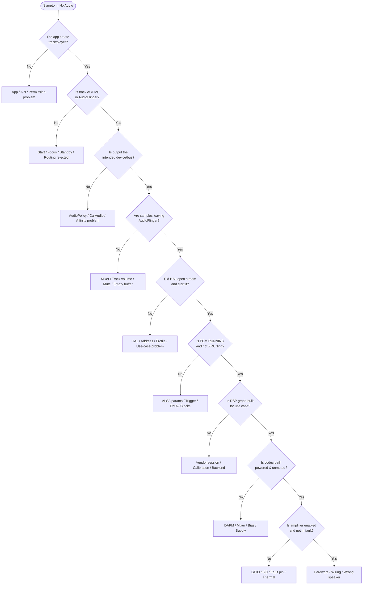

# Module 01 — Think in Layers

## Short Answer

Every audio bug lives at a **layer boundary**. Your first job is not to fix it. Your first job is to find the **last layer that still behaves correctly**. Everything below that layer is the investigation set. Everything above it is a distraction.

## Mental Model

Imagine a relay race.

```text
App hands a baton (PCM + meaning)
  → Framework decides the lane (device / zone / volume)
  → AudioFlinger runs the lap (mix + clock)
  → HAL opens the track on the hardware abstraction
  → ALSA/ASoC moves samples with DMA
  → DSP processes
  → Codec converts
  → Amplifier makes voltage/current
  → Speaker moves air
```

If the crowd hears nothing, you do **not** start by blaming the speaker *or* the app. You ask: **who still has the baton?**

### Three-level definition: “layer”

**Beginner:** A layer is a stage the sound passes through.

**Engineer:** A layer is a component with its own state machine, logs, and failure modes.

**Expert:** A layer is an *ownership and trust boundary*. Crossing it usually means a process change (Binder), a user/kernel change (ioctl), or a hardware clock domain change (DAI/DSP/codec). Bugs cluster at those crossings.

## Architecture / Flow

Use this as the default investigation spine. Corrected from the common “straight pipe” picture: **AudioPolicy and AudioFlinger are peers**, not a stack with Policy under Flinger.

```text
Application
   ↓
AudioTrack / Media codec path
   ↓
AudioService / CarAudioService          ← policy meaning, focus, zones
   ↓
AudioPolicyService                      ← device / mix / volume decision
   ↓
AudioFlinger                            ← mix, threads, write to HAL
   ↓
Audio HAL                               ← open/start/write stream
   ↓
Vendor middleware (optional)            ← PAL / AudioReach / OEM
   ↓
ALSA PCM                                ← hw_params, trigger, write
   ↓
Kernel ASoC                             ← FE/BE, DAI, DMA
   ↓
I2S / TDM / SLIMbus / SoundWire
   ↓
DSP
   ↓
Codec
   ↓
Amplifier
   ↓
Speaker
```

Two different things travel down this spine:

| Path | What moves | Typical failure |
| --- | --- | --- |
| **Control path** | open, start, set device, set volume, mute, routing | Wrong device, no start, mute, no clocks |
| **Data path** | PCM frames | Silence, XRUN, distortion, leftover noise |

A track can be in the PLAYING state (control succeeded) while the data path is zeros, or the data path can be perfect while the amp enable GPIO is low.

## Detailed Explanation

### 1. The last-known-good layer

This is the most important debugging skill in the course.

Definition:

> The last-known-good layer is the lowest layer where you have **positive evidence** that the expected behavior still holds.

Examples of *positive* evidence:

| Layer | Positive evidence |
| --- | --- |
| App | `play()` returned; buffers are being written; session ID exists |
| AudioFlinger | Track is `ACTIVE` on a playback thread; `underruns` not exploding; write counters increase |
| AudioPolicy | Selected output device matches intent; patch exists |
| HAL | Stream opened on the expected address / PCM |
| ALSA | PCM state `RUNNING`; `avail` moves; no XRUN storm |
| DMA | Period interrupts increment (debugfs / ftrace, platform-specific) |
| DSP | Graph/session active for that use case (vendor logs) |
| Codec | DAC path powered; unmute; expected mixer route |
| Amp | Enable asserted; current draw increases |
| Speaker | Acoustic output (mic, dummy load, scope) |

“No error in logcat” is **not** positive evidence.

### 2. Symptom layer vs owning layer

The user-visible symptom is almost always at the ends:

- “I hear nothing” (speaker)
- “The app crashed” (application)
- “It sounds robotic” (any layer that drops or resamples badly)

The owning layer is where the **incorrect decision or stalled state** happened.

Classic example:

```text
Symptom:          Navigation is inaudible during media
Immediate effect: Media and nav mixed at full scale, then clipped or masked
Owning layer:     Either AudioPolicy/CarAudio routed both to the same mix
                  without a duck, or HAL mixed two buses without attenuation
Root cause:       car_audio_configuration.xml put MUSIC and NAVIGATION
                  on the same bus, so hardware ducking is impossible
```

If you “fix” this by making the nav app louder, you treated the symptom layer.

### 3. Horizontal vs vertical mistakes

**Vertical mistake:** looking only at one layer.

**Horizontal mistake:** looking at the right layer but the wrong *instance* (wrong zone, wrong PCM, wrong playback thread, wrong codec DAI).

AAOS makes horizontal mistakes common: you debug the primary cabin PCM while the stream was sent to a rear-seat bus.

### 4. Time is a layer too

Some bugs are not “wrong component” but “wrong moment”:

- Stream started before clocks
- Volume applied before the HAL stream existed
- Route changed while FastMixer was writing
- DSP graph torn down on idle, not rebuilt on the next write
- After suspend, PCM is RUNNING in software state but DAI clocks never returned

Always add **WHEN** to WHO.

## The reusable no-audio decision tree

Memorize this tree. You will specialize it later.

```text
No audio
   |
   +-- Did the app create a track / player?
   |       No  → App / API / permission / attribution problem
   |       Yes ↓
   +-- Is the track ACTIVE in AudioFlinger?
   |       No  → start/focus/standby/routing rejected, or wrong session
   |       Yes ↓
   +-- Is the selected output the intended device / bus?
   |       No  → AudioPolicy / CarAudio / device affinity problem
   |       Yes ↓
   +-- Are samples leaving AudioFlinger? (counters / tee sink)
   |       No  → mixer / track volume / mute / empty buffers
   |       Yes ↓
   +-- Did HAL open the expected stream and start it?
   |       No  → HAL / address / profile / use-case problem
   |       Yes ↓
   +-- Is the PCM RUNNING and not XRUNing?
   |       No  → ALSA params / trigger / DMA / clocks
   |       Yes ↓
   +-- Is the DSP graph (if any) built for this use case?
   |       No  → vendor session / calibration / backend
   |       Yes ↓
   +-- Is the codec path powered and unmuted?
   |       No  → DAPM / mixer / bias / supply
   |       Yes ↓
   +-- Is the amplifier enabled and not in fault?
   |       No  → GPIO / I2C / fault pin / thermal
   |       Yes ↓
   +-- Acoustic / electrical check at the load
           Still silent → hardware, connector, or you are on the wrong speaker
```



At every “No”, you stop going down and start gathering **layer-local** evidence.

## Source-Code Path

You do not need to read all of this yet. You need to know *where ownership is implemented*.

```text
App
  android.media.AudioTrack / MediaPlayer / ExoPlayer
      ↓ Binder
AudioService
  frameworks/base/services/core/java/com/android/server/audio/AudioService.java
      ↓ (AAOS) Binder
CarAudioService
  packages/services/Car/service/src/com/android/car/audio/CarAudioService.java
      ↓
AudioPolicyService / AudioPolicyManager
  frameworks/av/services/audiopolicy/
      ↓
AudioFlinger
  frameworks/av/services/audioflinger/
      ↓ libaudiohal
Audio HAL
  hardware/interfaces/audio/          (HIDL or AIDL)
      ↓
TinyALSA
  external/tinyalsa/
      ↓ ioctl
Kernel ASoC / PCM
  sound/core/, sound/soc/
```

Binder is the first big boundary. ioctl is the second. DAI clocks are the third.

## Debugging

Practice finding last-known-good on purpose.

### Exercise A — emulator or phone

1. Play a YouTube or Settings-screen control sound.
2. Run `adb shell dumpsys media.audio_flinger` while it plays.
3. Find:
   - Playback thread
   - Track session
   - Standby state
   - Output device
4. Run `adb shell dumpsys media.audio_policy` and find the same device.

If the track is ACTIVE and the device is `AUDIO_DEVICE_OUT_SPEAKER`, last-known-good is **at least AudioFlinger + Policy**. Silence after that is HAL/kernel/hardware.

### Exercise B — force a wrong layer

Mute the stream from the app UI, then dump again. The track may still exist but volume/mute state changes. You just watched a control-path change that looks like “no audio” to a user.

## Logs / Commands

| Question | Command / place |
| --- | --- |
| Does a track exist? | `dumpsys media.audio_flinger` |
| Which device did policy pick? | `dumpsys media.audio_policy` |
| Did the app even request playback? | `logcat` with `AudioTrack`, `AudioManager`, app tag |
| AAOS zone / group? | `dumpsys car_service --services CarAudioService` |
| Did kernel PCM start? | `dmesg`, `/proc/asound`, vendor PCM debug |
| Is it even this speaker? | Play a known-good tone on a known-good path |

How to read a first AudioFlinger glance:

```text
What you want to see:
  - A playback thread that is not in standby
  - A track with the app's session / usage
  - Non-zero frames written over time (dump twice)

What indicates a problem:
  - Thread in standby while user expects sound
  - Track PAUSED / STOPPED / DISABLED
  - Device type that is not the one you think you are listening to
  - Format/sample rate that the HAL may reject (look for open failures nearby)
```

Exact dump formatting changes across releases. Learn the *fields*, not a single golden screenshot.

## Common Mistakes

| Mistake | Why it fails |
| --- | --- |
| “The app called play(), so audio works.” | play() is a control-path success at the client. |
| “logcat is clean, so HAL is fine.” | Mute and wrong-route are often not errors. |
| “I hear a click, so the path is good.” | A click can be a pop from a power event with no valid PCM. |
| Debugging the primary zone on AAOS | The stream may be in another zone. |
| Starting at the codec driver | You skip 90% of software ownership. |
| Starting at the app forever | Some bugs are clocks. |

## Practice

A bug report says:

> “After Bluetooth disconnect, music does not come back to speaker. The media app still shows the pause/play button as playing.”

Answer in writing:

1. What is the symptom layer?
2. What is the expected path after BT disconnect?
3. Which two dumps do you take first, and what field would prove last-known-good is still AudioFlinger?
4. Give two hypotheses in *different* layers.

Then compare to this reasoning (read only after you write):

- Symptom layer: speaker / user.
- Expected: Policy should switch the output device from A2DP/LE back to speaker and AudioFlinger should reopen or retask the output.
- First dumps: `media.audio_policy` (selected device) and `media.audio_flinger` (thread device + track active). If the track is ACTIVE on `AUDIO_DEVICE_OUT_SPEAKER`, last-known-good is framework and you go to HAL/ALSA.
- Hypotheses: (A) Policy still thinks A2DP is available. (B) Policy switched but HAL failed to reopen speaker PCM. Those are different owners.

## Key Takeaways

1. Find last-known-good before you propose a fix.
2. Control path and data path fail independently.
3. AudioPolicy decides; AudioFlinger executes; they are peers.
4. Horizontal instance mistakes (wrong zone, wrong PCM) are as common as vertical ones.
5. The decision tree is a habit, not a script you run blindly.

## Next

[Module 02 — End-to-End Android Audio Architecture](02-end-to-end-android-audio-architecture.md)
