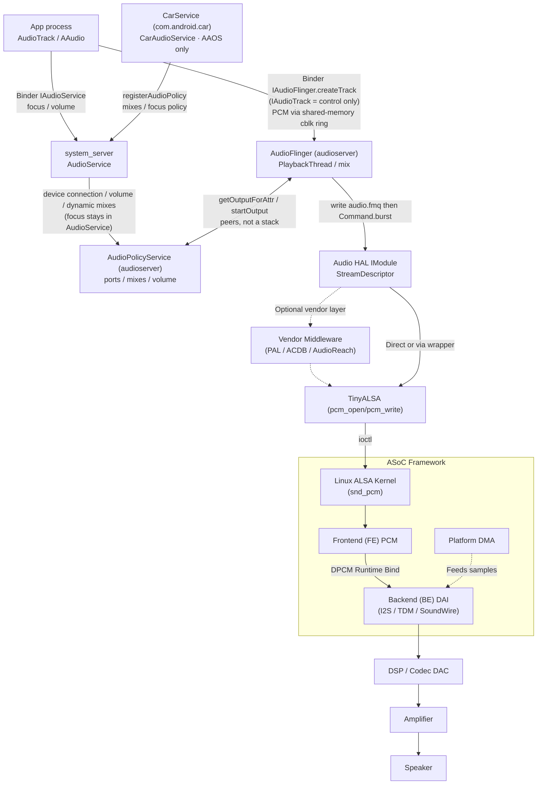
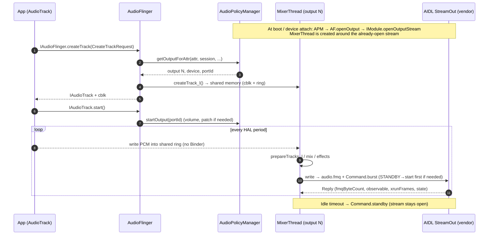

# Module 02 — End-to-End Android Audio Architecture

## Short Answer

Android audio is not a single service. It is a **split-brain design**:

- **AudioPolicy** answers “where should this stream go, at what volume, with what mixing strategy?”
- **AudioFlinger** answers “how do I mix these tracks on time and deliver PCM to the HAL?”

Everything above those two services is a client. Everything below them is a hardware abstraction that eventually becomes DMA, clocks, and analog voltage.

The common teaching diagram that puts AudioPolicy *under* AudioFlinger is wrong. They are **peer native services** that talk to each other.

## Mental Model

Think of a radio station.

| Role | Android component |
| --- | --- |
| Musicians | Apps writing PCM or encoded audio |
| Program director | AudioPolicy / CarAudioService |
| Mixing console + clock | AudioFlinger |
| Studio-to-transmitter interface | Audio HAL |
| Transmitter and antenna | ALSA, DSP, codec, amplifier, speaker |

If the program director sends the show to the wrong transmitter, the mixing console can be perfect and the audience still hears nothing. If the director is correct but the console is in standby, same symptom, different owner.

### Three-level definition: Audio system

**Beginner:** The software that makes the speaker play.

**Engineer:** A set of processes (`audioserver`, `system_server`, and on AAOS CarService, `com.android.car`) plus a vendor HAL and kernel drivers.

**Expert:** A real-time mixing server (AudioFlinger) coupled to a policy engine, isolated from apps by Binder, isolated from hardware by HAL, with a hard latency budget on some threads (FastMixer).

## Architecture / Flow

### Official AOSP layering (phone / generic Android)

Google’s public architecture (source.android.com/docs/core/audio) is:

```text
Application framework     android.media.*
        ↓ JNI
Native framework          frameworks/av/media/libaudioclient
        ↓ Binder IPC
audioserver
   AudioFlinger           frameworks/av/services/audioflinger
   AudioPolicyService     frameworks/av/services/audiopolicy
        ↓
Audio HAL                 hardware/interfaces/audio (HIDL or AIDL)
        ↓
Kernel driver             ALSA / other
```

TinyALSA (`external/tinyalsa`) is the recommended userspace ALSA library for HALs: it is small and BSD-licensed, while the full ALSA userspace library (alsa-lib) is LGPL-2.1.

### Corrected end-to-end map used in this course

This is the diagram you should be able to draw from memory. It fixes three problems in the “straight pipe” picture:

1. AudioPolicy and AudioFlinger are peers.
2. DMA and DAI are not sequential siblings of the same kind. DMA moves bytes. DAI is a digital audio interface/clock contract.
3. DSP placement is product-specific. It may sit on the SoC (ADSP), in the codec, or both.

```text
┌──────────────────────────────────────────────────────────┐
│  App process                                             │
│  AudioTrack / AudioRecord / MediaPlayer / AAudio         │
└───────┬──────────────────────────────────────────┬───────┘
        │ Binder IAudioService                     │ Binder IAudioFlinger.createTrack
        │ focus / volume / devices                 │ then shared-memory PCM
        v                                          v
┌───────────────────────────┐            ┌───────────────────────────┐
│ system_server             │            │ AudioFlinger (audioserver)│
│  AudioService             │            │  - PlaybackThread         │
│  (+ CarAudioService AAOS) │            │  - RecordThread           │
└─────────────┬─────────────┘            │  - mixer / effects        │
              │ devices / volume         │  - StreamDescriptor I/O   │
              v                          └─────────────┬─────────────┘
┌───────────────────────────┐                          │
│ AudioPolicyService        │◄── getOutputForAttr ─────┤
│  - devices / profiles     │    startOutput           │
│  - strategies / mixes     │    (peers in audioserver,│
│  - patches                │     not a stack)         │
│  - volume curves          │                          │
└───────────────────────────┘                          v
                                                Audio HAL (IModule)
                                                       v
                                           optional vendor PAL / OEM
                                                       v
                                                TinyALSA pcm_open/write
                                                       v
                                                   Kernel PCM
                                                       v
                                    ASoC FE ──► BE DAI ──► I2S/TDM/SoundWire
                                                       v
                                          DMA periodically feeds DAI
                                                       v
                                           DSP and/or Codec DAC
                                                       v
                                                    Amplifier
                                                       v
                                                     Speaker
```

The app does **not** Binder to AudioPolicy for `createTrack`. Flinger asks Policy. Focus never carries PCM.



### Control path vs data path (draw both)

The trace below follows one music track through every process on this map. Watch the path label on each step: only steps 7 to 14 carry PCM.

```aa-flow
# Interactive step player on the site: https://androidaudio.vercel.app/trace/play/
src: play-media
```


**Control path** for starting playback:

```text
AudioTrack constructor / native_setup
  → Binder IAudioFlinger.createTrack(CreateTrackRequest)
  → inside AudioFlinger::createTrack: AudioSystem::getOutputForAttr → AudioPolicyService  (device / output thread)
  → returns IAudioTrack

Focus is a different Binder, no PCM:
  AudioManager.requestAudioFocus → AudioService → MediaFocusControl
  (AAOS: CarAudioFocus via registerAudioPolicy — the app still only talks to AudioService)

AudioTrack.play()
  → Track::start
  → Policy startOutput (ref count / volume — route was already chosen)
  → if the (already open) HAL stream is in STANDBY: Command.start / first Command.burst
    (the stream was opened earlier by IModule.openOutputStream when APM opened the output)
  → first Command.burst
  → pcm_start / trigger START
  → DAI clocks + DMA running
```

The same control path as a sequence (AIDL HAL, Android 15). Note where `openOutputStream` sits: once, before any app plays.



**Data path** after start:

```text
App write / callback
  → AudioTrack shared memory / FastTrack
  → PlaybackThread mix
  → effects chain (optional)
  → write audio.fmq, then Command.burst
  → HAL empties FMQ → TinyALSA pcm_write (or vendor IPC)
  → kernel ring buffer
  → DMA
  → serializer (I2S/TDM)
  → DAC
  → amp
  → air
```

You must know which path a bug is on. A wrong `AudioAttributes.usage` is a control-path / policy-path bug. A repeating 20 ms dropout is a data-path / timing bug.

## Detailed Explanation

### 1. Processes you will see in `ps`

| Process | Role |
| --- | --- |
| App process | Client; must not be real-time responsible for the whole mix |
| `system_server` | `AudioService`, device callbacks, settings, (often) focus for phone |
| `audioserver` | AudioFlinger + AudioPolicyService (since the mediaserver split) |
| `cameraserver` / `mediaserver` | May still share codecs / NuPlayer paths; not the PCM mixer |
| CarService (`com.android.car`) | AAOS only; CarAudioService (dumpsys name `car_service`). A separate persistent process, not `system_server` |
| vendor audio daemon | Qualcomm and others; **not AOSP-universal** |

On modern Android, audio server isolation exists so a mixer crash does not kill the whole media process. Exact process split changed around Android 7 (`audioserver` split from `mediaserver`). Do not assume pre-7 process names.

### 2. Why Binder exists here

Apps must not talk to the HAL. Reasons:

- Permission and privacy (capture)
- One mixer, many clients
- Policy must see all streams
- HAL implementations are unstable across vendors
- Real-time mixing cannot be scheduled in a random app process

So the client is a Binder proxy. That has a cost: **IPC wakeups and copies** (mitigated by shared memory for audio buffers). No track sends PCM over Binder per buffer: after `createTrack`, samples move through the shared-memory `audio_track_cblk_t` ring and Binder carries only control calls. Fast tracks exist for a different reason: to skip the normal MixerThread's larger period and be mixed by FastMixer at the HAL period.

### 3. What “an output” means

Beginners say “the speaker.” Engineers must distinguish:

| Term | Meaning |
| --- | --- |
| **Device type** | `AUDIO_DEVICE_OUT_SPEAKER`, `..._BUS`, `..._A2DP`, etc. |
| **Audio port** | Graph node in policy (device port or mix port) |
| **I/O profile** | Formats, rates, channel masks a port can do |
| **Output / IAudioFlinger output** | An opened HAL stream + a PlaybackThread |
| **PCM device** | ALSA `card,device` |
| **Bus address** | AAOS `bus0_media_out` style string in policy XML |
| **DAI link** | Kernel ASoC connection |

A single speaker can be reached through different outputs (deep buffer vs fast vs compressed offload). “Routed to speaker” is incomplete. Ask: **which output thread, which HAL stream, which PCM, which DAI?**

### 4. Phone Android vs AAOS at this altitude

| Concern | Phone Android | AAOS |
| --- | --- | --- |
| Default router | AudioPolicy strategies + phone state | CarAudioService dynamic mixes + zones |
| Focus | AudioService focus | Per-zone Car audio focus (and optional OEM plugin) |
| Volume | Stream types / attributes → one device curve | Volume groups per zone, often `useFixedVolume` at HAL |
| Concurrent streams | Limited, mostly mix-in-software | Designed: nav + media + cluster, often separate buses |
| Hardware | One user, few endpoints | Many buses, amps, occupant zones |

AAOS does **not** replace AudioFlinger. It **programs** AudioPolicy so Flinger’s outputs already match cabin topology.

### 5. Where the DSP sits (do not freeze one picture)

Three common physical topologies:

```text
A. Cheap / codec-centric
   SoC I2S  →  Codec DAC (+ light DSP in codec)  →  Amp  →  Speaker

B. Qualcomm-like SoC DSP
   AudioFlinger → HAL → PAL → GPR → ADSP graph → AFE → I2S/SLIM/SoundWire
        → Codec → Amp → Speaker

C. External amplifier DSP
   SoC  →  Codec or direct I2S  →  Smart amp DSP  →  Speaker
```

If you assume picture B on a non-Qualcomm board, you will look for ADSP logs that do not exist. If you assume picture A on a flagship auto SoC, you will never find the real mute (a graph not built).

## Source-Code Path

Playback of a simple `AudioTrack` (conceptual; names are stable enough to search):

```text
Java:  android.media.AudioTrack.play()
  frameworks/base/media/java/android/media/AudioTrack.java
        ↓ JNI
  frameworks/base/core/jni/android_media_AudioTrack.cpp
        ↓
Native client:
  frameworks/av/media/libaudioclient/AudioTrack.cpp
    AudioTrack::start()
        ↓ Binder IAudioFlinger / IAudioTrack
AudioFlinger:
  frameworks/av/services/audioflinger/AudioFlinger.cpp
  frameworks/av/services/audioflinger/Tracks.cpp  (all track types; header PlaybackTracks.h)
  frameworks/av/services/audioflinger/Threads.cpp
        ↓ may call
AudioPolicy:
  frameworks/av/services/audiopolicy/service/AudioPolicyService.cpp
  frameworks/av/services/audiopolicy/managerdefault/AudioPolicyManager.cpp
        getOutputForAttr / startOutput / getDeviceForStrategy
        ↓
HAL wrapper:
  frameworks/av/media/libaudiohal/          (AIDL client on the reference platform)
        ↓
StreamOutHalAidl (wraps the stream opened earlier via IModule.openOutputStream)
        ↓
Command.burst on audio.fmq
        ↓
Vendor HAL implementation (device-specific)
        ↓
TinyALSA pcm_write  (or vendor IPC — not universal)
```

Capture is a mirror with `AudioRecord` → RecordThread → HAL `IStreamIn` → `pcm_read`.

MediaPlayer / ExoPlayer still end in an `AudioTrack` (or AAudio, which still lands in AudioFlinger or a special MMAP path). Do not treat MediaPlayer as a bypass of this architecture.

## Runtime Behavior: a 10-second story

A music app starts a stereo 48 kHz track with `USAGE_MEDIA`.

1. `AudioTrack` constructor Binders to **AudioFlinger** (`IAudioFlinger.createTrack`). The app does not call Policy.
2. Flinger calls `AudioSystem.getOutputForAttr`. AudioPolicy selects a strategy (MEDIA) and a device (speaker, or a bus on AAOS).
3. AudioFlinger attaches the track to an existing PlaybackThread that already matches that output, or, for direct/offload outputs, APM opens a new one on demand (`AudioFlinger::openOutput` → `IModule.openOutputStream`). Mixer outputs for attached devices were already opened at boot.
4. The HAL stream is **already open**: APM opened the output (and AudioFlinger called `IModule.openOutputStream`) at boot or device attach, and the PlaybackThread wraps that stream. If the thread is in **standby**, the first write after `play()` sends `Command.start`/`Command.burst` to leave standby. Many vendor HALs close the ALSA PCM (or tear down a DSP graph) on standby and run `pcm_open` again here — that is a vendor choice, and it is the usual cause of late first sound.
5. `play()` marks the track ACTIVE. The mixer thread wakes.
6. The app writes PCM. The mixer writes `audio.fmq` and sends `Command.burst`.
7. ALSA periods elapse. DMA keeps the DAI fed.
8. If the app stops writing, the track underruns; after idle, the thread goes back to standby (`threadLoop_standby` → `Command.standby`). The stream stays open; the vendor HAL may release the PCM.

Standby is why “first sound after idle is late” is a different bug from “steady-state glitch.”

## Debugging

### What you verify at this module’s level

Not “why is my codec register 0x22 cleared.” Instead:

1. Which **process** mixed the audio?
2. Which **output thread** owns the track?
3. Which **device type / address** did policy select?
4. Was the (already open) HAL stream in standby when play started, and how long did standby exit take?

### First correlation exercise

Play a tone. In two shells:

```bash
adb shell dumpsys media.audio_flinger > /tmp/af1.txt
sleep 1
adb shell dumpsys media.audio_flinger > /tmp/af2.txt
adb shell dumpsys media.audio_policy > /tmp/ap.txt
```

Diff `af1` and `af2`. Frames-written or standby flags should move if data is flowing. Then confirm the device in `ap.txt` matches the thread in `af2.txt`.

If they disagree, you have a **split-brain** bug (policy vs flinger), which is rarer and very high value.

## Logs / Commands

```bash
# Process layout
adb shell ps -A | grep -E 'audioserver|mediaserver|com.android.car|system_server'

# Service presence
adb shell service list | grep -i audio

# HAL generation hint (varies by device)
adb shell lshal | grep -i audio          # HIDL
adb shell dumpsys media.audio_flinger    # often prints HAL version / module
```

On the reference platform you should see `android.hardware.audio.core.IModule` (instance `default`). `lshal` listing `android.hardware.audio@7.1` means a HIDL vendor HAL — treat that as a deviation and translate with Module 23. New audio HAL APIs after Android 14 exist only on AIDL.

## Common Mistakes

| Mistake | Correction |
| --- | --- |
| Drawing AudioPolicy under AudioFlinger | They are peers inside `audioserver` |
| Thinking MediaPlayer bypasses AudioFlinger | It almost never does for final PCM |
| Equating “device” with “PCM” | Many PCMs can implement one device type |
| Putting DMA and DAI in series as the same kind of block | DMA is data movement; DAI is interface/clocks |
| Assuming a Qualcomm ADSP on every product | Vendor-specific |
| Assuming AAOS replaces AudioPolicy | AAOS *configures* it via dynamic policy |

## Practice

Redraw the architecture from memory. Then mark:

1. Where a Binder call happens.
2. Where an ioctl happens.
3. Where a hardware clock must start.
4. Where AAOS inserts CarAudioService.

If you cannot mark those four, reread the diagrams before Module 03.

**Diagnostic question:** A dump shows an ACTIVE track on a deep-buffer PlaybackThread whose device is `AUDIO_DEVICE_OUT_BUS` with address `bus1_navigation_out`, but the user is testing a music app. Which layer is already telling you the story?

Write your answer. Expected reasoning: Policy/CarAudio mapped this stream’s attributes to the navigation bus. Either the app used the wrong usage, or the car configuration mapped MUSIC to the nav bus. AudioFlinger is doing what it was told. Last-known-good for “Flinger is mixing” can still be true while the *meaning* is wrong.

## Key Takeaways

1. Policy decides; Flinger executes; HAL abstracts; kernel moves; analog emits.
2. Always draw control path and data path separately.
3. “Output,” “device,” “PCM,” and “DAI” are four different objects.
4. AAOS adds a zone/context layer; it does not delete Core Audio.
5. Standby means the lower path may not exist until the first real start.

## Next

[Module 02A — End-to-End Playback Walkthrough](02a-playback-walkthrough.md) to trace one playback through every hop, or skip ahead to [Module 03 — AudioPolicy vs AudioFlinger](03-audio-policy-vs-audioflinger.md).
