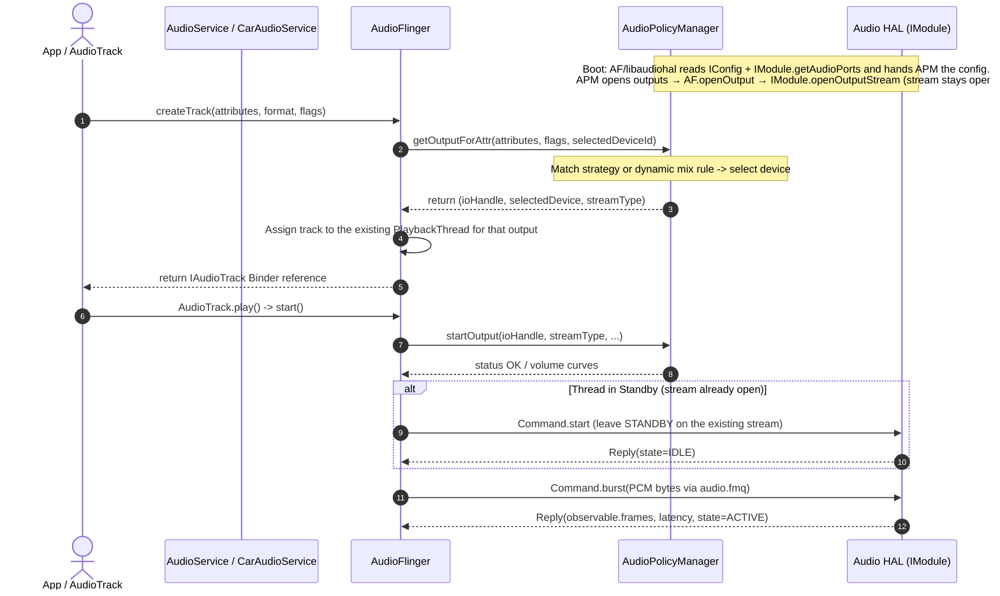

# Module 03 — AudioPolicy vs AudioFlinger

## Short Answer

**AudioPolicy is the decision engine. AudioFlinger is the execution engine.**

If the wrong speaker plays, start with Policy. If the right speaker is selected but the sound is glitchy, silent after start, or late, start with Flinger (then HAL). If you cannot tell which device is selected, you do not have enough evidence to blame either one.

## Mental Model

A restaurant:

| Role | Service | Question it answers |
| --- | --- | --- |
| Host / menu rules | **AudioPolicy** | Which table (device)? Can these guests sit together (mix)? What is the bill (volume)? |
| Kitchen | **AudioFlinger** | Cook the tickets on time, combine plates, hand them to the pass (HAL). |

The kitchen does not decide that navigation should duck media. The host does not chop vegetables at 48 kHz.

### Three-level definitions

**AudioPolicy**

- **Beginner:** Chooses the speaker or headset.
- **Engineer:** Selects devices, outputs, strategies, patches, and volumes from attributes, connected devices, and phone/car state.
- **Expert:** A policy manager plus an engine (default or configurable) that consumes HAL-declared topology and produces mix ports, device ports, and patches that AudioFlinger instantiates as threads and HAL streams.

**AudioFlinger**

- **Beginner:** Mixes apps together and talks to hardware.
- **Engineer:** Owns tracks, playback/record threads, timing, effects, and HAL read/write.
- **Expert:** A real-time server: thread-per-output, standby, submix, offload, MMAP/fast paths, tee sink, and the only AOSP component that *must* meet the period deadline.

## Comparison table

| | AudioPolicy | AudioFlinger |
| --- | --- | --- |
| Process | `audioserver` | `audioserver` |
| Typical dump | `dumpsys media.audio_policy` | `dumpsys media.audio_flinger` |
| Primary input | AudioAttributes, devices, call state, AAOS mixes | Tracks, buffers, clocks |
| Primary output | Chosen device / output / patch / volume index | Mixed PCM to HAL |
| Time scale | Event-driven (route, focus-related queries, device connect) | Periodic (every period, often 2–20 ms) |
| Failure signature | Wrong device, no output found, volume group 0, rejected start | XRUN, standby stuck, underrun, muted track, glitch |
| You change it when | Product routing/volume rules change | Mixer behavior, timing, track lifecycle |
| Talks to HAL for | Topology, some parameters, patches | Stream open/start/write/stop/close |

They interact constantly:

```text
AudioFlinger needs an output for a new track
        ↓
AudioPolicyManager.getOutputForAttr(...)
        ↓
returns output / flags / selected device
        ↓
AudioFlinger attaches the track to the PlaybackThread of that (already open) output
        ↓
startOutput() / setDevice connection notifications
        ↓
Policy updates volumes and may request reroutes
        ↓
Policy installs a new audio patch on the same output (createAudioPatch → IModule.setAudioPatch);
only a device on another module/mixPort (A2DP, USB) needs a different output
```

## Architecture / Flow

```text
                    AudioService / CarAudioService
                              |
              +---------------+---------------+
              |                               |
              v                               v
     setDevice / setVolume            createTrack / start
     registerPolicyMixes              write / read
              |                               |
              v                               v
     ┌─────────────────┐            ┌─────────────────┐
     │ AudioPolicy     │◄──────────►│ AudioFlinger    │
     │  Service        │  queries    │                 │
     │  Manager        │  callbacks  │  Threads        │
     │  Engine         │            │  Tracks         │
     └────────┬────────┘            └────────┬────────┘
              |  get topology                |  I/O
              +---------------+---------------+
                              v
                         Audio HAL
```



On this course’s Android 15 AIDL platform, topology comes from **`IModule.getAudioPorts` / `getAudioRoutes` and `IConfig`** — queried by AudioFlinger's libaudiohal (`DevicesFactoryHalAidl` / `DeviceHalAidl`) and handed to APM through `getAudioPolicyConfig()`. APM has no direct HAL binder. A default HAL may convert leftover XML internally. HIDL-era APM-reads-XML is history. The *roles* stay the same; the *config transport* is an API.

## Detailed Explanation

### 1. What Policy actually decides

Typical decisions:

- Which **strategy** or **product strategy** an attribute maps to (MEDIA, PHONE, SONIFICATION, ENFORCED_AUDIBLE, …).
- Which **device type** that strategy currently uses (speaker vs A2DP vs bus).
- Whether a stream is **mixer**, **direct**, or **offload**.
- Whether to create a **dynamic mix** (AAOS registers these heavily).
- The **volume** to apply for that stream/device (or to send as a gain command when fixed-volume is used).
- Whether an output can be **reused** by a new track.

Policy does **not** mix PCM.

### 2. What Flinger actually executes

Typical work:

- Create `IAudioTrack` / `IAudioRecord` Binder objects.
- Attach tracks to a `PlaybackThread` or `RecordThread`.
- Mix (or memcpy for direct/offload).
- Apply per-track volume, mute, and some effects.
- Sleep until the next HAL period.
- Call HAL `write` / `read`.
- Enter **standby** when idle to save power.
- Report underruns.

Flinger does **not** invent cabin routing rules.

### 3. Volume is a handshake

This surprises people.

```text
User presses volume
  → AudioService or CarAudioService
  → AudioPolicy computes index → volume curve
  → Flinger applies stream/track volumes in the mixer
     (AAOS fixed volume instead: CarAudioService → setAudioPortGain(mB)
      → IModule.setAudioPortConfig with AudioGainConfig)
```

On phones, software attenuation in the mixer is common. On AAOS with `useFixedVolume`, Android often **does not** attenuate PCM; CarAudioService converts the volume-group index into a **gain in millibels** (from the `<gain>` declared on the bus device port) and applies it with `AudioManager.setAudioPortGain()` → `IModule.setAudioPortConfig(AudioGainConfig)`, so the amplifier or DSP applies gain. The HAL never sees an index. If you look at Flinger track volume and it is 1.0 while the cabin is quiet, that can be *correct*.

### 4. Two engines inside Policy

AOSP has more than one policy *engine*:

| Engine | Where | Style |
| --- | --- | --- |
| Default engine | `enginedefault` | Hard-coded strategies and product-ish rules |
| Configurable Audio Policy (CAP) | `engineconfigurable` | XML/AIDL-described strategies, volumes, criteria |

AAOS historically used **dynamic audio policy mixes** registered by CarAudioService on top of the default/CAP world. Android 14+ can lean further on CAP (CarService overlay flags `audioUseCoreRouting`, `audioUseCoreVolume`). If a document says “strategy MEDIA,” confirm which engine the build uses.

### 5. Failure signatures you should memorize

| Observation | First suspect |
| --- | --- |
| Track exists, device is `NONE` or unexpected bus | Policy / CarAudio config |
| `getOutputForAttr` fails; app gets constructor error | Policy + profiles (format/rate not supported) |
| Right device, thread in standby, no writes | Flinger start / empty buffers / track not ACTIVE |
| Right device, writes increment, silence | HAL / ALSA / DSP / mute |
| Glitches every period | Flinger timing / scheduler / HAL blocking write |
| Volume UI moves, acoustic level does not | Volume handshake (fixed volume, wrong group, HAL gain) |
| Two streams should duck, both full scale | Policy/Car ducking or both on one mixed bus |

## Source-Code Path

Search these first (paths are stable in spirit; file names shift slightly by release):

```text
AudioPolicyService
  frameworks/av/services/audiopolicy/service/AudioPolicyService.cpp
    - Binder interface for policy
    - Forwards to AudioPolicyInterface / AudioPolicyManager

AudioPolicyManager
  frameworks/av/services/audiopolicy/managerdefault/AudioPolicyManager.cpp
    - getOutputForAttr
    - getDeviceForStrategy / getDeviceForAttr (names evolve)
    - startOutput / stopOutput
    - setDeviceConnectionState
    - setStreamVolume / setVolumeIndexForAttributes

Default engine
  frameworks/av/services/audiopolicy/enginedefault/

Configurable engine
  frameworks/av/services/audiopolicy/engineconfigurable/

AudioFlinger
  frameworks/av/services/audioflinger/AudioFlinger.cpp
    - createTrack / createRecord
  Threads.cpp
    - threadLoop
    - standby
    - mixer loop
  Tracks.cpp  (headers PlaybackTracks.h / RecordTracks.h)
    - start / stop / pause
```

When reading `getOutputForAttr`, follow the return value back into `AudioFlinger::createTrack`. That single hop is the policy/execution handshake.

## Debugging

### Decision tree: Policy or Flinger?

```text
Unexpected audio behavior
   |
   +-- Is the selected device / bus correct for the usage and zone?
   |       Unknown → dumpsys media.audio_policy (+ car_service)
   |       No      → Policy / CarAudio / XML / device connection
   |       Yes     ↓
   +-- Is there a PlaybackThread on that device with an ACTIVE track?
   |       No      → Flinger never started or track went idle
   |       Yes     ↓
   +-- Do write counters / frames move?
           No      → Flinger mixer / track volume 0 / no app data
           Yes     → Leave Policy+Flinger; go HAL and below
```

### How to read the two dumps together

You are looking for a **join key**:

- output / I/O handle
- device type + address
- session ID
- port ID / patch ID (newer dumps)

If Policy says `bus0_media_out` and Flinger’s thread shows a different address, stop and explain the disagreement before you touch a codec.

## Logs / Commands

```bash
adb shell dumpsys media.audio_policy
adb shell dumpsys media.audio_flinger
adb shell dumpsys audio          # AudioService view (Java)
```

Useful log tags (availability varies):

- `APM_AudioPolicyManager`
- `APM::AudioPolicyEngine` and other engine tags (grep `LOG_TAG` in `services/audiopolicy/engine*` on your branch)
- `AudioFlinger`
- `AudioHwDevice`
- `AF::Track`

What a healthy pair looks like while media plays on speaker:

```text
Policy:
  - speaker (or the expected bus) is available and selected for MEDIA
  - a mix / output exists with matching rate/channels

Flinger:
  - a MixerThread (or similar) is NOT in standby
  - track state ACTIVE
  - device bits include SPEAKER (or BUS with the right address)
```

What indicates a problem:

```text
Policy selected A2DP, user unplugged BT five minutes ago
Flinger thread still in standby after play()
Track volume 0.000 or muted flag set
No output found for attributes (look at rate/channel/format)
```

## Common Mistakes

| Mistake | Reality |
| --- | --- |
| “AudioFlinger routes audio” | It applies a route Policy already chose |
| “AudioPolicy mixes nav and media” | It decides they *may* share an output; Flinger or HAL mixes |
| Editing mixer paths XML to fix a strategy bug | Wrong layer if Policy never selected that backend |
| Assuming stream-type volume on AAOS | Volume groups + fixed volume are common |
| Reading only one dump | You cannot see the handshake |

## Practice

**Question:** `dumpsys media.audio_policy` shows MEDIA → `AUDIO_DEVICE_OUT_SPEAKER`. `dumpsys media.audio_flinger` shows the only ACTIVE track on a thread whose device is `AUDIO_DEVICE_OUT_BUS` `bus0_media_out`. Music is heard in the cabin.

1. Is this a bug?
2. Which dump is “more true” for where PCM is going?
3. What product type is this likely to be?

Write first. Then:

1. Not necessarily. On AAOS, the *speaker* the user means is often a **bus device** that Policy still might describe in different views. But a *disagreement* between the two dumps is always worth explaining, not ignoring.
2. Flinger’s thread device is the sink of the output's current audio patch (set by Policy through `createAudioPatch`). That is where PCM is going.
3. Likely AAOS or a bus-based primary HAL. On a phone you should be suspicious.

**Second question:** A phone user connects a headset. Media continues on the speaker for one second, then jumps. Who owned each part of that second?

Expected: device connect event → Policy recomputes device → for a wired headset on the same HAL module, Policy installs a **new audio patch** on the existing output (`createAudioPatch` → `PlaybackThread::createAudioPatch_l` → `IModule.setAudioPatch`) — no stream reopen. PCM already queued in Flinger and HAL buffers still plays out first. The one second is usually buffer drain, vendor path switching (mixer controls, amp ramp) and the app's own buffering, not Policy being “slow at deciding.” Only a device on another module/mixPort (A2DP, USB) needs a different output.

## Key Takeaways

1. Policy = decide. Flinger = execute on a deadline.
2. Always join the two dumps on device/output/session.
3. Volume and ducking are policy decisions applied by Flinger and/or HAL.
4. Wrong device is Policy until proven otherwise. Glitch is Flinger/HAL until proven otherwise.
5. AAOS mostly programs Policy; it does not replace Flinger.

## Next

[Module 04 — AudioTrack, AudioRecord, and Media APIs](04-audiotrack-audiorecord-media-apis.md)
