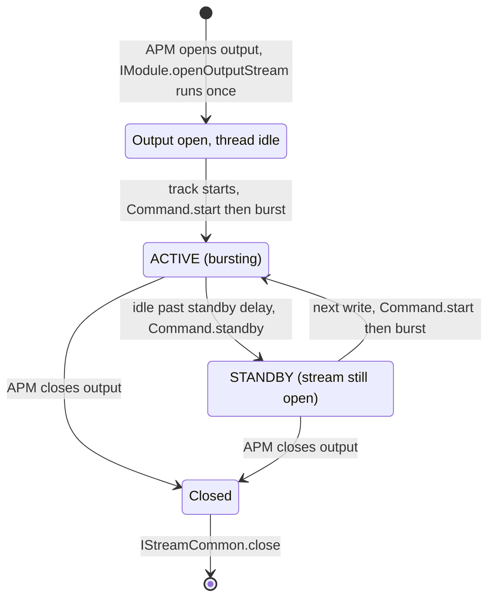

# Module 06 — AudioFlinger Internals

## Short Answer

AudioFlinger is the **real-time execution server**. It owns tracks, playback/record threads, mixing, a subset of effects, standby, and the HAL write/read loop. If Policy is correct and you still have silence, glitches, or “starts then dies,” you are in Flinger’s state machine or the HAL it calls.

Learn the main thread families: **Mixer** (with its **FastMixer** helper for fast tracks), **Direct**, **Offload** — plus the MMAP path that skips the mix. Almost every playback mystery is “which thread am I on, and is that thread actually running?”

## Mental Model

A train station:

- Each **PlaybackThread** is a platform with its own timetable (period).
- Each **Track** is a train car filling with passengers (frames).
- The **mixer** couples cars onto one departing train (HAL write).
- **Standby** means the platform turned the lights off to save electricity — the tunnel (HAL stream) is still there.
- **Underrun** means a car was empty when the timetable said “depart.”

### Three-level definition: AudioFlinger

**Beginner:** The service that mixes audio and talks to hardware.

**Engineer:** Native service in `audioserver` that manages tracks, threads, buffers, effects, and HAL streams.

**Expert:** A collection of timed threads with different latency/power contracts, sharing a device/output space defined by Policy, using shared memory with clients, and isolating FastMixer from Binder and from blocking HAL behavior as much as the design allows.

## Architecture / Flow

```text
IAudioFlinger Binder
        |
        +-- createTrack / createRecord
        +-- sample rate / format queries
        +-- setMasterVolume / setVoiceVolume (some still exist)
        |
        v
AudioFlinger
        |
        +-- PlaybackThread(s)  ← one per opened output (created around the
        |     MixerThread          HAL stream from IModule.openOutputStream)
        |       + optional FastMixer (a FastThread owned by the MixerThread,
        |         not a PlaybackThread)
        |     SpatializerThread / BitPerfectThread (MixerThread variants)
        |     DirectOutputThread
        |     OffloadThread
        |     DuplicatingThread
        |     MmapPlaybackThread  (AAudio MMAP; exclusive mode bypasses the mix)
        |
        +-- RecordThread(s)    ← one per opened input
        |     (+ optional FastCapture), DirectRecordThread, MmapCaptureThread
        |
        +-- AsyncCallbackThread (helper for non-blocking/offload HAL callbacks)
        |
        +-- Effects (pre/post, on thread or HAL)
        |
        v
AIDL IModule stream
  StreamDescriptor: Command.burst / standby
  (HIDL write() is history on the reference platform)
```

### Mixer loop (the heartbeat)

Steps 5 to 10 of the playback trace are the AudioFlinger part: the track and its shared memory, `play()`, the app writing into the ring, the MixerThread loop, FastMixer, and the hand-off to the HAL.

```aa-flow
# Interactive step player on the site: https://androidaudio.vercel.app/trace/play/
src: play-media
steps: 5-10
```


```text
threadLoop:
    if no active tracks:
        after the standby delay: threadLoop_standby() → Command.standby
        (the HAL stream stays open; the vendor HAL may release its PCM)
        wait for work
    else:
        pull frames from each ACTIVE track
        apply track volume / mute
        mix
        run software effects
        burst into StreamDescriptor audio.fmq
        (the blocking write/burst is what paces the loop; the thread
         only sleeps when it has nothing to write)
```

If this loop blocks in `write()`, the period is late. Listeners hear a glitch or the HAL itself underruns.

## Detailed Explanation

### 1. Track states you must recognize

Exact enum names vary slightly by release; the *ideas* do not.

| Idea | Meaning |
| --- | --- |
| Idle / stopped | Client created or stopped; not consuming mix slots |
| Paused | Started once; clocks may still run briefly; no app progress expected |
| Active | Eligible for mix |
| Stopping / draining | Playing out remaining frames |
| Terminated | Client gone; binder died |

A user-visible “playing” UI can exist while the Flinger track is paused (focus loss) or stopped (app bug). Always believe Flinger over the UI.

### 2. Thread types

| Thread | Mixes? | Typical period | Use |
| --- | --- | --- | --- |
| **MixerThread** (normal / deep buffer) | Yes | Larger (often ~10–20 ms class; product-specific) | Media, power saving |
| FastMixer *(helper, not a PlaybackThread)* | Yes, small set of fast tracks | Small (often ~2–5 ms class, the HAL period) | Touch sounds, low-latency tracks. A `FastThread` (`services/audioflinger/fastpath/FastMixer.cpp`) owned by a MixerThread |
| **SpatializerThread** | Yes, then spatializer effect | Mixer-like | Spatial audio / binaural output (Android 13+) |
| **BitPerfectThread** | Single bit-perfect track (or mix when not bit-perfect) | Mixer-like | USB bit-perfect playback (Android 14+) |
| **DirectOutputThread** | No (single track) | Matches stream | HDMI passthrough, exclusive PCM |
| **OffloadThread** | No | Burstier | Compressed offload to DSP |
| **DuplicatingThread** | Yes, fans out | Follows outputs | Play the same mix on two devices |
| **MmapPlaybackThread** / **MmapCaptureThread** | No (exclusive) | HAL burst | AAudio MMAP. In exclusive mode the app writes the shared buffer directly; there is no AudioFlinger mix |
| **RecordThread** (+ optional FastCapture) | N/A | Input period | Capture |
| **DirectRecordThread** | N/A | Matches stream | Direct (e.g. compressed) capture |

`AudioFlinger::openOutput_l` logs which kind it created (“created mmap playback / spatializer / offload / direct / mixer output”). `AsyncCallbackThread` is a helper for non-blocking/offload HAL callbacks, not an output.

**Mixer vs FastMixer**

| Aspect | Normal mixer | FastMixer |
| --- | --- | --- |
| Latency | Higher | Lower |
| CPU / power | Lower wake rate | Higher |
| Effects | More flexible | Restricted |
| Blocking | Bad but somewhat tolerated | Catastrophic |
| Logging | `ALOGx` OK-ish | Prefer NBLOG / media.log |

If an app requested low latency and landed on a deep buffer thread, either Policy picked a non-fast output or AudioFlinger denied the FastTrack (sample-rate mismatch, effects, no free fast slot — look for `AUDIO_OUTPUT_FLAG_FAST denied`). That is a **decision**, not a mixer bug.

### 3. Buffer math you will use daily

```text
period_frames     = frames transferred each interrupt / write
period_count      = number of periods in the ring
buffer_frames     = period_frames * period_count
period_ms         = period_frames / sample_rate * 1000
buffer_ms         = buffer_frames / sample_rate * 1000
```

Example: 48 kHz, period 240 frames, 4 periods:

```text
period_ms = 240 / 48000 * 1000 = 5 ms
buffer_ms = 20 ms
```

The app-level `AudioTrack` buffer is **another** buffer on top of the HAL ring. Total latency is roughly:

```text
app buffer + mixer / FastMixer pipeline + HAL buffer + DSP + analog
```

Module 15 goes deeper. Here, just remember: **Flinger cannot invent clocking**. It writes into whatever period the HAL accepted at open.

### 4. Standby

Standby is the most misunderstood Flinger feature.

When no track needs the output:

1. After a standby delay with no active tracks, the thread stops writing.
2. `threadLoop_standby()` puts the stream in standby: on AIDL that is `Command.standby` (StreamDescriptor state `STANDBY`). The HAL stream is **not closed** — it was opened when Policy opened the output (boot or device attach) and stays open.
3. The vendor HAL often closes the ALSA PCM and tears down the DSP graph on standby. That is a vendor choice, not an AudioFlinger rule.

The next write after `start()` sends `Command.start`/`burst` on the same stream and pays the vendor's **bring-up cost**: clocks, calibration, amp pop suppression, graph build. “First navigation prompt is clipped” is often standby bring-up, not a broken DAC.



Some products keep a **fast path always warm** (touch sounds). Media deep buffer goes cold. Two threads, two standby policies.

### 5. Shared Memory & Buffer Architecture

Audio data never travels over Binder IPC. Instead, AudioFlinger uses **POSIX shared memory (`ashmem` / `memfd`)**:

```text
┌──────────────────────────────────────────────────────────┐
│ App Process                                              │
│   AudioTrackClientProxy                                  │
│     - obtainBuffer(&buffer, waitDeadline)                │
│     - write samples directly into shared memory          │
│     - releaseBuffer(&buffer)                             │
└───────────────────────────┬──────────────────────────────┘
                            │
               Shared Memory Circular Ring
               (Mapped into both address spaces)
                            │
┌───────────────────────────▼──────────────────────────────┐
│ audioserver Process                                      │
│   AudioTrackServerProxy                                  │
│     - obtainBuffer(&buffer) [Non-blocking]               │
│     - PlaybackThread::MixerThread reads & mixes samples  │
│     - releaseBuffer(&buffer)                             │
└──────────────────────────────────────────────────────────┘
```

**Key Buffer Mechanics:**
- **`obtainBuffer()` / `releaseBuffer()`**: The fundamental producer-consumer handshake. The app requests a writable slice of the ring buffer, writes PCM, and releases it. The mixer thread pulls readable slices in its periodic mix cycle.
- **Normal Track FIFO**: Sized to hold several periods (typically 4–8 periods, e.g. 40–160ms) to tolerate application scheduling jitter.
- **FastTrack FIFO**: Sized tightly to match the FastMixer period (e.g. 2–5ms). If the app fails to deliver data in time, FastMixer does not block—it increments the underrun counter and mixes silence for that track to avoid starving the hardware.

### 6. Volume and mute inside Flinger

Flinger can apply:

- master mute
- stream / attribute volume (if not fixed-volume)
- per-track volume
- VolumeShaper (fades, including AAOS 15 enforced fade)

If PCM leaving Flinger is already digital zero, HAL cannot recover it. Use tee sink (Module 20) or dump volumes when you need to prove this.

### 7. Audio Effects Architecture & Chains

Effects in Android are organized into **`EffectChain`** instances managed by AudioFlinger:

```text
[Track 1 (Session S)] ──► [Track EffectChain (Session S)] ──┐
                                                           ├─► [Mixer] ──► [Post-Proc / Global Chain (Session 0)] ──► HAL
[Track 2 (Session S)] ──► (shares Session S effects) ──────┘
```

#### Effects Categories:
1. **Pre-processing Effects (Capture)**: Acoustic Echo Cancellation (AEC), Noise Suppression (NS), Automatic Gain Control (AGC) attached to `RecordThread`.
2. **Insert Effects (Playback Session)**: Equalizer, Bass Boost, Virtualizer attached to a specific `audio_session_t`.
3. **Auxiliary / Send Effects**: Environmental Reverb, where tracks send a fraction of their energy to a shared effect bus.
4. **Post-Processing / Device Effects**: Dynamics Processing (DP), Speaker Protection, and Spatializer attached to the output device or Session 0.

#### Framework vs Offloaded HAL Effects:
- **Software Effects**: CPU libraries such as `libbundlewrapper.so` / `libreverbwrapper.so` / `libdynproc.so` in `/vendor/lib*/soundfx`. Since Treble they are loaded by the **effects HAL service** (AIDL `android.hardware.audio.effect` `IFactory`, service `vendor.audio-effect-hal-aidl`), **not** by audioserver. AudioFlinger's `EffectChain` drives each one through `IEffect` and FMQ, so the processing runs in the HAL process on CPU.
- **Offloaded / Hardware Effects**: Same AIDL `IFactory` / `IEffect` interface, but processing occurs in the DSP. `libeffectproxy` is the HW/SW offload *proxy* that switches between a software and an offloaded implementation; it is not a CPU effect by itself.

#### Effect Gotchas & Fast Path Demotion:
- **Fast Path Demotion**: If a FastTrack attaches a software effect that cannot meet real-time timing deadlines, AudioFlinger **demotes** the track from FastMixer to a regular MixerThread. Symptom: Latency jumps from 4ms to 40ms upon enabling Equalizer.
- **Spatializer (Android 12+)**: Runs as a specialized post-processing engine. Can process multi-channel (5.1/7.1) or ambisonics and output binaural stereo. Requires explicit Policy routing support (`AUDIO_OUTPUT_FLAG_SPATIALIZER`).

### 8. FastMixer and logging

AOSP documents that `ALOGx` can block and disturb FastMixer. `NBLOG` + `media.log` exist so you can log without wrecking timing. If you sprinkle `ALOGE` in the fast loop on a debug build, you may create the glitch you are chasing.

### 9. Server crash behavior

If `audioserver` dies:

- Clients see `DEAD_OBJECT`
- `init` restarts `audioserver` (its `.rc` `onrestart` hooks also restart the audio and effect HAL services)
- `AudioTrack` / `AudioRecord` in libaudioclient transparently re-create most tracks (`AudioTrack::restoreTrack_l()`); the app usually just hears a gap
- `MediaPlayer` clients get `MEDIA_ERROR_SERVER_DIED`; AAudio streams are disconnected and the app must reopen them
- HAL streams close and are reopened when Policy re-opens its outputs

A one-time pop plus every app going silent is a **server death**, not a codec. Check tombstones.

## Source-Code Path

```text
frameworks/av/services/audioflinger/AudioFlinger.cpp
  AudioFlinger::createTrack
  AudioFlinger::createRecord
  dump()

frameworks/av/services/audioflinger/Threads.cpp
  ThreadBase
  PlaybackThread::threadLoop
  MixerThread
  DirectOutputThread
  OffloadThread
  SpatializerThread / BitPerfectThread / MmapThread
  RecordThread

frameworks/av/services/audioflinger/fastpath/FastMixer.cpp   (older trees: services/audioflinger/FastMixer.cpp)
frameworks/av/services/audioflinger/Tracks.cpp      (all track types; headers PlaybackTracks.h / RecordTracks.h)
frameworks/av/services/audioflinger/Configuration.h (TEE_SINK compile flag)

HAL glue:
frameworks/av/media/libaudiohal/
```

When reading `threadLoop`, annotate:

- Where standby is entered
- Where mix happens
- Where HAL write is called
- What happens on write error

That is the execution core of Android audio.

## Debugging

```text
Track missing
   → create failed (Policy/format) or you have the wrong session

Track present, not ACTIVE
   → play() not called, focus pause, or start rejected

Track ACTIVE, thread in standby
   → inconsistent dump moment, or start has not woken the thread yet
      (dump twice)

Track ACTIVE, counters frozen
   → mixer stuck, HAL write blocked, or track delivering zeros
      (tee sink / timestamps)

Counters move, user hears glitches
   → underrun count climbing: producer too slow or period too small
   → underrun count stable: HAL/DSP/clock issue below Flinger

Counters move, user hears nothing
   → leave Flinger; HAL and below (or volume 0 — check first)
```

Dump twice, one second apart. Frozen numbers are a fact. A single dump is a photograph without motion.

## Logs / Commands

```bash
adb shell dumpsys media.audio_flinger
adb shell pidof audioserver
adb logcat -s AudioFlinger AF::Track AudioMixer FastMixer
```

How to read a PlaybackThread block (field names vary; hunt these ideas):

```text
What the thread is:
  - type: mixer / fast / direct / offload
  - sample rate, format, channel mask
  - period / frame count
  - device bits + address
  - standby yes/no

What each track is:
  - session, UID, pid
  - usage / attributes if printed
  - state
  - volume / mute
  - underrun count
  - frames written / presented
```

Problem patterns:

```text
standby: yes                    while user expects sound
underrun: climbing quickly      app or scheduler
volume: 0.000                   policy/focus/fade/mute
device: A2DP                    while you listen to the built-in speaker
format: unexpected rate         resample cost or open failure nearby
```

The tee sink (userdebug/eng only; source.android.com still documents `TEE_SINK` and the `af.tee` property, while current AudioFlinger implements it in `afutils/NBAIO_Tee` writing under `/data/misc/audioserver` — verify on your branch) can write a WAV of what Flinger mixed. That is how you prove “zeros left Flinger” vs “zeros began below HAL.” Details in Module 20 and source.android.com/docs/core/audio/debugging.

## Common Mistakes

| Mistake | Reality |
| --- | --- |
| Treating all PlaybackThreads as equal | Fast vs deep vs offload are different machines |
| Chasing codec pops that are standby bring-up | Measure first-start vs steady-state separately |
| Logging in FastMixer with `ALOGE` | You may cause the XRUN |
| Believing the media app “Playing” badge | Flinger state is the truth |
| Assuming software volume is applied on AAOS | Fixed volume may leave Flinger at 1.0 |

## Practice

Dump excerpt (illustrative, not a promise of exact syntax):

```text
Output thread 0x... MixerThread 48000 Hz standby no
  device: 0x1000000 (AUDIO_DEVICE_OUT_BUS) addr=bus0_media_out
  Track session 77 uid 10080 ACTIVE vol=1.0 underrun=0
Output thread 0x... MixerThread 48000 Hz standby yes
  device: 0x2 (AUDIO_DEVICE_OUT_SPEAKER)
```

The user is in a car and hears nothing from the door speakers. The media app is playing.

1. Is Flinger mixing something?
2. Is the phone speaker path relevant?
3. What do you check next?

Expected:

1. Yes — an ACTIVE track on `bus0_media_out`.
2. The speaker thread is in standby; this is likely AAOS. Do not debug the phone speaker PCM.
3. Confirm CarAudio mapping and then HAL/ALSA for `bus0_media_out`. Last-known-good is Flinger on the bus.

## Key Takeaways

1. Flinger is a set of timed threads, not a single mixer.
2. Thread type is a contract: latency, effects, power, XRUN physics.
3. Standby keeps the HAL stream open; the vendor HAL decides whether the hardware path is torn down.
4. Dump twice to see motion.
5. Prove whether PCM leaving Flinger is alive before you blame the DSP.

## Next

[Module 07 — AudioPolicy: Routing and Devices](07-audiopolicy-routing-and-devices.md)
