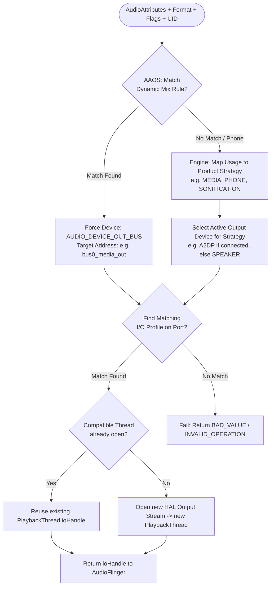
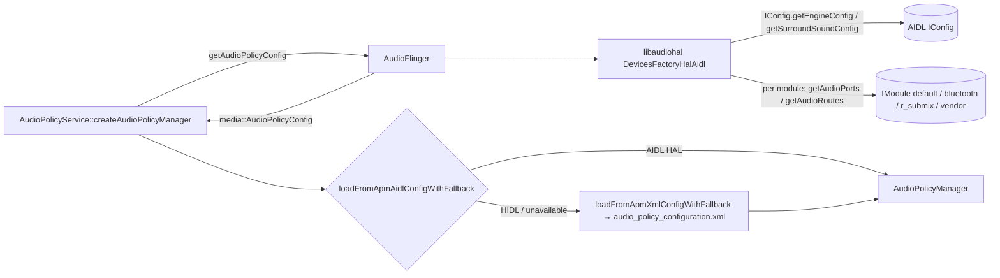

# Module 07 — AudioPolicy: Routing and Devices

## Short Answer

AudioPolicy turns **meaning + topology + current connections** into a concrete **output or input**. Routing is a decision about **ports and patches**, not about I2S pins. If the wrong device is selected, you debug Policy, its engine, its XML/AIDL configuration, and (on AAOS) CarAudio’s dynamic mixes — not the codec first.

## Mental Model

Policy is a graph problem.

```text
Sources (apps / usages / strategies)
        ↓
Mix ports  (what Flinger can open: primary, deep_buffer, compress_offload, r_submix, bus mixes…)
        ↓
Device ports (speaker, headset, a2dp, usb, bus0_media_out, …)
        ↓
Patches (this mix is currently connected to that device)
```

You do not “route to I2S2” in Policy. You route to a **device port** whose HAL implementation eventually opens a PCM that the machine driver wired to I2S2.

### Three-level definition: routing

**Beginner:** Choosing speaker vs headphones vs Bluetooth.

**Engineer:** Selecting a device type (and address) for a strategy or attribute, given currently available devices.

**Expert:** Building or choosing an audio patch between a mix port and one or more device ports, subject to profiles (rate/format/channels/flags), exclusive devices, dynamic mixes, and engine rules. On AIDL HAL, the declared topology may be queried from the HAL instead of parsed only from XML.

## Architecture / Flow

```text
Device connect / disconnect
  (headset jack, BT profile, USB, dock)
        ↓
AudioService / HAL callback
        ↓
AudioPolicyManager.setDeviceConnectionState
        ↓
engine recomputes preferred device per strategy
        ↓
same module (speaker ↔ wired headset):
  setOutputDevices → new audio patch on the existing output
  (AF createAudioPatch → PatchPanel → PlaybackThread::createAudioPatch_l
   → IModule.setAudioPatch) — no stream reopen
device on another module / mixPort (A2DP, USB):
  checkOutputsForDevice opens a new output
  (AF openOutput → IModule.openOutputStream) and tracks are invalidated/moved
```

```text
New track with AudioAttributes
        ↓
getOutputForAttr()
        ↓
map attributes → strategy or product strategy
        ↓
select device for that strategy
        ↓
select an I/O profile that supports format/rate/channels/flags
        ↓
return output handle to Flinger
```



### Phone routing vs AAOS routing

| | Phone Android | AAOS with dynamic routing |
| --- | --- | --- |
| Key | strategy (MEDIA, PHONE, …) | CarAudioContext → bus address |
| Who builds mixes | Static `audio_policy_configuration.xml` | CarAudioService registers dynamic mixes at runtime |
| Typical device | `SPEAKER`, `A2DP`, `USB_HEADSET` | `AUDIO_DEVICE_OUT_BUS` + address |
| Multi-user | Rare | Per-zone user-id device affinity |
| Override | `setPreferredDevice` / communication device | Zone config switch, cast, mirror |

Same Policy *code*, different **mix graph**.

## Detailed Explanation

### 1. Device types vs addresses

`AUDIO_DEVICE_OUT_SPEAKER` is a **type**. On phones there is usually one.

`AUDIO_DEVICE_OUT_BUS` is also a type, but there are **many buses**. They are distinguished by **address** (`bus0_media_out`). Car audio configuration and audio policy configuration must use the **same address string**. A typo here is a classic “everything compiles, nothing plays where you think.”

### 2. Profiles are admission control

A device port lists profiles:

```xml
<!-- illustrative shape; schema depends on HAL version -->
<profile format="AUDIO_FORMAT_PCM_16_BIT"
         samplingRates="48000"
         channelMasks="AUDIO_CHANNEL_OUT_STEREO"/>
```

If an app asks for 44.1 kHz surround and no profile (and no resampler path) accepts it, **create fails**. That is Policy saying no, not ALSA saying no — although the profiles *should* match what the HAL can actually open.

Lies in XML are a frequent root cause: Policy thinks 96 kHz is fine; HAL open fails; Flinger cannot start.

### 3. Strategies (default engine)

The default engine groups usages into strategies. Exact lists evolve, but the idea is stable:

| Strategy (concept) | Typical usages |
| --- | --- |
| Media | media, game, unknown |
| Phone | voice communication |
| Sonification | UI, sonification |
| Enforced audible | camera click even if muted (policy-dependent) |
| Accessibility / assistant | assistant |
| DTMF | DTMF |

Each strategy has a **device category preference** (e.g. media prefers A2DP if connected; ringing may prefer speaker).

Do not memorize one year’s enum as eternal. Read the engine for your branch.

### 4. Dynamic mixes (critical for AAOS)

CarAudioService builds `AudioPolicy.AudioPolicyMix` objects:

- match on usage / attributes
- force output to a specific device address
- associated with a user id (affinity)

Then it registers them with AudioService / Policy. After that, `getOutputForAttr` hits a **mix rule** before generic strategy logic.

If `audioUseDynamicRouting` is false, this entire mechanism is off.

### 5. Patches

A **patch** is a live connection: source port(s) → sink port(s).

Examples:

- mix port `primary` → device port `speaker`
- device port `FM tuner` → mix port (loopback)
- mix → two devices (duplication)

`dumpsys media.audio_policy` listing patches is how you see **current** routing, not just possible topology.

A routing change on the same module is a **new patch**, not a new stream:

```text
AudioPolicyManager::setOutputDevices
  → installPatch → AudioPolicyService client → AudioFlinger::createAudioPatch
  → PatchPanel::createAudioPatch
  → PlaybackThread::createAudioPatch_l      (mix → device: the thread's sink changes)
  → DeviceHalAidl::createAudioPatch → IModule.setAudioPatch   (AIDL)
```

Device → device patches (FM tuner → speaker, call audio, bus-to-bus) that the HAL cannot route by itself become **software patches**: PatchPanel opens a RecordThread and a PlaybackThread and pipes PCM between them. Only devices that need a different mixPort/module (A2DP, USB, `r_submix`) cause Policy to open a new output (`checkOutputsForDevice`).

### 6. Preferred devices and app overrides

Apps and system UI can request a preferred device (Bluetooth hearing aid, USB, communication device for VoIP). These interact with strategy rules. When debugging “it ignored the headset,” ask whether:

- the device was **connected in Policy** (not just in Bluetooth settings)
- a **preferred device** or communication device is sticky
- an AAOS mix is forcing a bus (preferred BT may lose)

### 7. Configuration transport on Android 15 (AIDL)

APM does **not** own a vendor XML as its primary contract, and it has **no direct HAL binder**. `AudioPolicyService::createAudioPolicyManager` asks AudioFlinger for `getAudioPolicyConfig()`; AudioFlinger's libaudiohal (`DevicesFactoryHalAidl` / `DeviceHalAidl`) queries the HAL and converts the result; APM loads it with `AudioPolicyConfig::loadFromApmAidlConfigWithFallback()` (falling back to `loadFromApmXmlConfigWithFallback()` — the XML file — on HIDL devices). The HAL calls underneath are:

```text
IModule.getAudioPorts / getAudioRoutes          ← via AudioFlinger/libaudiohal
IConfig.getEngineConfig / getSurroundSoundConfig
IModule.connectExternalDevice   ← jack / USB / BT (AF forwards APM's setDeviceConnectionState)
IModule.setAudioPatch           ← live route (APM → AF createAudioPatch → PatchPanel → HAL)
```

A default AIDL HAL may still *implement* those calls by converting `audio_policy_configuration.xml`. Bring-up teams often edit that file. Your debug question is: **does `dumpsys media.audio_policy` show the port the converter claimed?** If not, the converter or `IModule` implementation is wrong.

HIDL XML/XSD and the v6→v7 space-separator script are history (Module 23). Do not run them as the 15 procedure.



### 7a. Reading `audio_policy_configuration.xml` (what the converter and HIDL devices consume)

Even on Android 15 AIDL devices you will meet this file: the AOSP default HAL and many vendor HALs convert it into `IModule` ports and routes. Its anatomy (abridged, illustrative; check your device's file):

```xml
<audioPolicyConfiguration version="7.0" xmlns:xi="http://www.w3.org/2001/XInclude">
  <globalConfiguration speaker_drc_enabled="true"/>
  <modules>
    <module name="primary" halVersion="3.0">          <!-- AIDL: IModule instance "default" -->
      <attachedDevices>                                <!-- always present: opened at boot -->
        <item>Speaker</item>
        <item>Built-In Mic</item>
      </attachedDevices>
      <defaultOutputDevice>Speaker</defaultOutputDevice>
      <mixPorts>                                       <!-- each opened mixPort = one output / thread -->
        <mixPort name="primary output" role="source" flags="AUDIO_OUTPUT_FLAG_PRIMARY AUDIO_OUTPUT_FLAG_FAST">
          <profile name="" format="AUDIO_FORMAT_PCM_16_BIT"
                   samplingRates="48000" channelMasks="AUDIO_CHANNEL_OUT_STEREO"/>
        </mixPort>
        <mixPort name="deep_buffer" role="source" flags="AUDIO_OUTPUT_FLAG_DEEP_BUFFER">
          <profile name="" format="AUDIO_FORMAT_PCM_16_BIT"
                   samplingRates="48000" channelMasks="AUDIO_CHANNEL_OUT_STEREO"/>
        </mixPort>
        <mixPort name="compress_offload" role="source" maxOpenCount="1"
                 flags="AUDIO_OUTPUT_FLAG_DIRECT AUDIO_OUTPUT_FLAG_COMPRESS_OFFLOAD AUDIO_OUTPUT_FLAG_NON_BLOCKING">
          <profile name="" format="AUDIO_FORMAT_MP3" samplingRates="44100 48000"
                   channelMasks="AUDIO_CHANNEL_OUT_STEREO AUDIO_CHANNEL_OUT_MONO"/>
        </mixPort>
        <mixPort name="primary input" role="sink">
          <profile name="" format="AUDIO_FORMAT_PCM_16_BIT"
                   samplingRates="8000 16000 48000" channelMasks="AUDIO_CHANNEL_IN_MONO"/>
        </mixPort>
      </mixPorts>
      <devicePorts>
        <devicePort tagName="Speaker" type="AUDIO_DEVICE_OUT_SPEAKER" role="sink">
          <gains>
            <gain name="gain_1" mode="AUDIO_GAIN_MODE_JOINT"
                  minValueMB="-8400" maxValueMB="4000" defaultValueMB="0" stepValueMB="100"/>
          </gains>
        </devicePort>
        <devicePort tagName="Wired Headset" type="AUDIO_DEVICE_OUT_WIRED_HEADSET" role="sink"/>
        <devicePort tagName="Built-In Mic" type="AUDIO_DEVICE_IN_BUILTIN_MIC" role="source"/>
      </devicePorts>
      <routes>                                         <!-- which mixPorts can reach which device -->
        <route type="mix" sink="Speaker" sources="primary output,deep_buffer,compress_offload"/>
        <route type="mix" sink="Wired Headset" sources="primary output,deep_buffer,compress_offload"/>
        <route type="mix" sink="primary input" sources="Built-In Mic"/>
      </routes>
    </module>
    <xi:include href="r_submix_audio_policy_configuration.xml"/>
    <xi:include href="usb_audio_policy_configuration.xml"/>
    <xi:include href="bluetooth_audio_policy_configuration_7_0.xml"/>
  </modules>
  <xi:include href="audio_policy_volumes.xml"/>
  <xi:include href="default_volume_tables.xml"/>
</audioPolicyConfiguration>
```

How to read it:

| Element | What it means at runtime |
| --- | --- |
| `module` | One HAL module (AIDL `IModule` instance; `primary` maps to `default`). `bluetooth`, `usb`, `r_submix` are separate modules. |
| `attachedDevices` | Devices that are always present. APM opens outputs that can reach them **at boot** — this is when `openOutputStream` runs for mixer outputs. |
| `mixPort` | A stream type the HAL can open (`role="source"` = playback). Flags pick the thread type: `FAST`/`PRIMARY` → MixerThread with FastMixer, `DEEP_BUFFER` → MixerThread, `DIRECT`/`COMPRESS_OFFLOAD` → Direct/Offload thread, `MMAP_NOIRQ` → MMAP. `maxOpenCount`/`maxActiveCount` limit concurrent opens/actives. |
| `profile` | Supported format/rate/channel combinations. Since version 7.0, lists are **space-separated**. |
| `devicePort` | A physical or logical endpoint. On AAOS, `AUDIO_DEVICE_OUT_BUS` ports carry an `address` (e.g. `bus0_media_out`) and a `<gain>` stage that CarAudioService uses for fixed-volume gain in millibels. |
| `route` | Which sources can feed a sink. `type="mix"` = the HAL can mix several sources; `type="mux"` = only one source at a time. |
| `xi:include` | Pulls in per-module files and the volume curves (`audio_policy_volumes.xml`, `default_volume_tables.xml`). |

If a device works on HIDL but not after an AIDL conversion, compare the ports and routes in `dumpsys media.audio_policy` with this file — the converter may have dropped a profile or route.

CAP (CarService overlay flags `audioUseCoreVolume` / `audioUseCoreRouting`) can sit on top. On **15**, CAP data is typically still file-based. Full CAP-over-AIDL is **16+**.

## Source-Code Path

```text
frameworks/av/services/audiopolicy/service/AudioPolicyService.cpp

frameworks/av/services/audiopolicy/managerdefault/AudioPolicyManager.cpp
  setDeviceConnectionStateInt
  getOutputForAttr
  getInputForAttr
  startOutput / stopOutput
  registerPolicyMixes

frameworks/av/services/audiopolicy/enginedefault/
frameworks/av/services/audiopolicy/engineconfigurable/

AAOS mix registration:
packages/services/Car/service/src/com/android/car/audio/CarAudioService.java
packages/services/Car/service/src/com/android/car/audio/CarAudioZonesHelper.java
  (helper names vary by release)
```

Read `getOutputForAttr` with a paper log:

```text
attributes in
  → mix match?
  → strategy?
  → device?
  → profile match?
  → output handle out
```

That function is the routing brain.

## Debugging

```text
Wrong or no device
   |
   +-- Is the physical device connected in Policy?
   |       No  → connection path (BT profile, USB attach, jack, HAL callback)
   |       Yes ↓
   +-- Which strategy / context did attributes map to?
   |       Unexpected → attributes or engine/XML map
   |       Expected ↓
   +-- Is a dynamic mix capturing this usage?
   |       Yes → CarAudio / OEM mix rules (address typo?)
   |       No  ↓
   +-- Does a profile accept format/rate/channels?
   |       No  → XML lie or app format
   |       Yes ↓
   +-- Does Flinger open that output successfully?
           No  → HAL open (now you may leave Policy)
```

### XML consistency checklist (AAOS)

1. Every address in `car_audio_configuration.xml` exists as a device port advertised by `IModule.getAudioPorts()` (and therefore in `dumpsys media.audio_policy`). If you still have a converter XML, the address must be there too — but Policy’s truth is the HAL port list.
2. Gain / volume curve blocks exist if Policy expects them.
3. Module names match the HAL module that actually implements the bus.
4. Channel masks match the physical amp (2 vs 4 vs 8).

Official docs: devices referenced by car audio config **must** be defined in the audio policy configuration.

## Logs / Commands

```bash
adb shell dumpsys media.audio_policy
adb shell dumpsys media.audio_flinger     # join on device/address
adb logcat -s APM_AudioPolicyManager AudioPolicyService
```

How to read Policy dump (hunt ideas, not exact banners):

```text
Available devices:
  - types + addresses + connected state

Outputs / mix ports:
  - sample rate, channels
  - attached devices

Patches:
  - who is connected to whom *now*

Dynamic mixes / policy mixes:
  - matching usages
  - forced devices
```

Problem patterns:

```text
A2DP still “available” after user disconnected
No BUS address that matches car XML
Mix exists but patch still points at speaker
getOutputForAttr logs “no output found”
```

## Common Mistakes

| Mistake | Reality |
| --- | --- |
| Editing kernel DAI to fix Policy device selection | Wrong layer |
| Duplicating addresses with slight name changes | Mixes silently fail to bind |
| Assuming headset connect in Settings = Policy connected | BT A2DP may not be up yet |
| Forgetting profiles when adding 24-bit / 96 kHz | Create fails or falls back oddly |
| Thinking `AUDIO_DEVICE_OUT_SPEAKER` is the cabin on AAOS | Cabin is usually BUS devices |

## Check yourself

Pick an answer before you look. The explanation, with the Android 15 source line, opens after you choose.

```aa-quiz
# 1 single-choice check (portal/content/quizzes/checks.yaml), interactive on the site: https://androidaudio.vercel.app/learn/07/#sec-check-yourself
ids: [q-headset-patch]
```

## Practice

You add a new chime usage and a new bus `bus8_chime_out` in `car_audio_configuration.xml`. Media still plays. Chime is silent. Policy dump shows no device with that address.

1. Last-known-good layer?
2. Immediate failure?
3. Most likely root cause?

Expected:

1. App and Flinger may not even have a track if create failed; or a track exists on a fallback device. The Policy dump already says the bus is unknown.
2. Policy has no such device port.
3. You forgot to declare the bus in `audio_policy_configuration.xml` (or AIDL HAL config) with that exact address.

## Key Takeaways

1. Routing is ports, profiles, and patches — not pins.
2. `getOutputForAttr` is the function to read.
3. AAOS routing is dynamic mixes + addresses; XML must agree.
4. A profile lie becomes a HAL open failure later.
5. Device *connection state* is part of the decision, not just topology.

## Next

[Module 08 — Audio HAL: Legacy, HIDL, AIDL](08-audio-hal-legacy-hidl-aidl.md)
