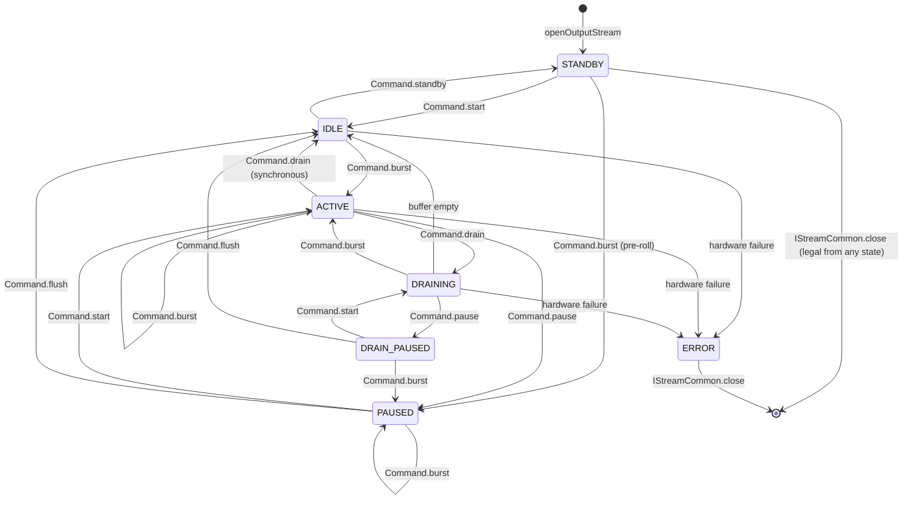

# Module 08 — Audio HAL (AIDL on Android 15+)

## Short Answer

On this course’s reference platform the Audio HAL is **Stable AIDL**:

- Core: `android.hardware.audio.core` — entry **`IModule`**
- Effects: `android.hardware.audio.effect` — entry **`IFactory`**
- Shared types: `android.hardware.audio.common` and `android.media.audio.common`

AudioFlinger opens streams on `IModule` and moves PCM through a **`StreamDescriptor`**: command FMQ + reply FMQ + audio FMQ (`burst`), not through HIDL `IStreamOut.write()`.

Audio Policy Manager **gets its topology from the HAL** (`IModule.getAudioPorts`, `getAudioRoutes`, `IConfig`) — via AudioFlinger's libaudiohal, which queries the HAL and hands APM the converted config. APM itself has no HAL binder. A leftover XML file may exist *inside* a vendor `IConfig` implementation. You still debug the AIDL objects.

HIDL (`android.hardware.audio@7.1` and earlier) is **history**. New HAL APIs after Android 14 are **AIDL-only**.

## Mental Model

The HAL is still a customs border. On Android 15 the passport is AIDL.

```text
Framework language                 HAL language
attributes, patches, tracks   →    IModule ports, routes, patches
Flinger period write          →    StreamDescriptor.Command.burst
standby()                     →    Command.standby  (state STANDBY)
setParameters("key=value")    →    get/setVendorParameters (Parcelable)
audio_policy_configuration.xml→    IConfig + IModule.getAudioPorts
IPrimaryDevice telephony      →    ITelephony
IPrimaryDevice BT SCO/HFP     →    IBluetooth
```

### After the HAL (juniors: who calls whom)

The HAL is the **last AOSP object**. Flinger never calls PAL or ALSA. The **vendor HAL** does one of these:

```text
Command.burst  (Flinger → HAL)
        │
        ├─ generic product
        │     HAL → TinyALSA pcm_write → ALSA PCM → ASoC → DAI → DAC/amp
        │
        └─ Qualcomm-like product
              HAL → PAL (HLOS use-case)
                     → AGM (HLOS builds DSP graph)
                        → GPR/IPC → ADSP
                           → AFE → DAI → DAC / smart amp
```

**PAL** and **AGM** run on HLOS (the apps processor). The **DSP** is a different computer. **DAI** carries samples. **DCI** (on most codec datasheets) is I2C/SPI for mute/gain — not the music. Details: Modules 09–11 and 16.

### Three-level definition: AIDL Audio HAL

**Beginner:** The vendor service that actually talks to the drivers, using Android’s current interface language.

**Engineer:** A set of AIDL services registered with ServiceManager. Flinger’s `libaudiohal` is the client. Each opened stream has an AIDL interface *and* a `StreamDescriptor` for real-time I/O.

**Expert:** Modules register by instance name (`default`, `bluetooth`, `r_submix`, …). There is no `IDevicesFactory`. `IPrimaryDevice` is split into `ITelephony` + `IBluetooth` retrieved from the primary (`default`) `IModule`. Stream I/O is a documented state machine on a **high-priority HAL thread** that the *vendor* must create. Patches, pause, resume, and drain are **mandatory**.

## Architecture / Flow

```text
AudioFlinger / AudioPolicy
        ↓
libaudiohal   (AIDL client in frameworks/av/media/libaudiohal)
        ↓
ServiceManager
   IModule/default          ← primary (was "primary" in HIDL)
   IModule/bluetooth
   IModule/r_submix
   IConfig
   IFactory (effects)
        ↓
vendor.audio-hal-aidl process
        ↓
Vendor implementation
        ↓
TinyALSA / PAL / other
```

### Core interfaces you must be able to name

| AIDL | Role |
| --- | --- |
| `IModule` | Entry. Ports, routes, patches, open streams, master mute/volume, vendor params |
| `IConfig` | System-wide config (engine config, surround list, …) that HIDL kept in XML |
| `IStreamOut` / `IStreamIn` | Stream Binder interface |
| `IStreamCommon` | Shared stream ops: close, effects, vendor params, HW AV sync |
| `StreamDescriptor` | FMQ command / reply / audio (or mmap) + state machine |
| `ITelephony` | Mode, TTY, HAC, voice volume — from primary `IModule` |
| `IBluetooth` | SCO / HFP config — from primary `IModule` |
| `ISoundDose` | Sound-dose support |

Reference implementation: `hardware/interfaces/audio/aidl/default/`.

### Data path (this is the Android 15 sentence)

Steps 10 to 12 of the playback trace cross this boundary: libaudiohal writes the data FMQ and sends `burst`, the HAL worker drains it, and the backend writes ALSA.

```aa-flow
# Interactive step player on the site: https://androidaudio.vercel.app/trace/play/
src: play-media
steps: 10-12
```


```text
IModule.openOutputStream(...)
        ↓
returns IStreamOut + StreamDescriptor
        ↓
Flinger writes PCM into audio.fmq
        ↓
Flinger sends Command.burst(byteCount) on command FMQ
        (one command slot; waits on reply.fmq)
        ↓
HAL high-priority thread wakes, reads the command,
and must empty audio.fmq even if it cannot use every byte.
Reply:
   status, fmqByteCount (consumed; may be < written),
   observable position, latencyMs, xrunFrames, State
Flinger resends any remainder on the next burst.
        ↓
later: Command.standby  →  State.STANDBY  →  clocks/graph may drop
```

Do not say “HAL write()” unless you mean the vendor’s *internal* TinyALSA `pcm_write` after it has taken the burst.

### Stream states (from `StreamDescriptor.aidl`)

| State | Meaning |
| --- | --- |
| `STANDBY` | Initial after open. Producer and consumer inactive. Hardware may sleep. |
| `IDLE` | Hardware active. Input may fill/overwrite; output emits zeros. XRUNs **not** counted (client is not doing I/O). |
| `ACTIVE` | Periodic I/O expected. Late client = `xrunFrames`. |
| `PAUSED` | Consumer inactive. Output hardware emits silence. Burst while paused stays `PAUSED` (fills the buffer). Resume is `Command.start` → `ACTIVE`. `flush` → `IDLE`. |
| `DRAINING` | Producer stopped; consumer empties the buffer. Transient. |
| `DRAIN_PAUSED` | Drain paused (output). |
| `TRANSFERRING` / `TRANSFER_PAUSED` | Async/non-blocking burst in flight (used when HAL operates in async callback mode; most typical playback paths use synchronous burst and will not enter these states). |
| `ERROR` | Unrecoverable. Only legal next step is close. |

This state machine is **part of the HAL contract**, not an AudioFlinger private enum. When you dump a stream, look for these names.



This is the **synchronous output** machine (`stream-out-sm.gv`) — the MixerThread path. There is no `Command.standby` from `PAUSED`; Flinger flushes to `IDLE` first. Async HALs add `TRANSFERRING` / `TRANSFER_PAUSED` (`stream-out-async-sm.gv`).

### Topology path (Policy)

```text
HIDL era:  APM parses vendor audio_policy_configuration.xml (XSD is HAL contract)

AIDL era:  AudioPolicyService::createAudioPolicyManager
             → AudioFlinger getAudioPolicyConfig()
             → libaudiohal (DevicesFactoryHalAidl / DeviceHalAidl) calls:
             IModule.getAudioPorts()
             IModule.getAudioRoutes()
             IConfig.getEngineConfig()
             IConfig.getSurroundSoundConfig()
           → APM: AudioPolicyConfig::loadFromApmAidlConfigWithFallback()
             (HIDL / unavailable → loadFromApmXmlConfigWithFallback(): XML)
           External device (APM decision, AF forwards):
             IModule.connectExternalDevice / disconnectExternalDevice
           Live route (APM → AF createAudioPatch → PatchPanel → HAL):
             IModule.setAudioPatch / resetAudioPatch / setAudioPortConfig
```

The AOSP default `IConfig` can still **convert XML to AIDL types** so vendors can migrate. If Policy’s idea of a bus does not match `getAudioPorts()`, the lie is now in the HAL implementation (or its converter), not in “APM misread a file APM no longer owns.”

### Effects HAL (AIDL)

| AIDL | Role |
| --- | --- |
| `IFactory` | `queryEffects`, `queryProcessing`, `createEffect` |
| `IEffect` | `open`, `setParameter` / `getParameter`, `command(START/STOP/RESET)` |
| `Descriptor` / `Capability` / `Parameter` | Capabilities and params |

Effect libraries are loaded and executed by the **effects HAL service** (AIDL `IFactory`, e.g. service `vendor.audio-effect-hal-aidl`), not inside audioserver. AudioFlinger's EffectChain drives each effect through `IEffect` and FMQ. The AOSP default AIDL factory parses `audio_effects_config.xml`. `libeffectproxy` is the HW/SW offload *proxy*, not a CPU effect. Do not start an Android 15 debug at the legacy `audio_effects.xml` unless the vendor’s `IFactory` still reads one.

## Detailed Explanation

### 1. Why AIDL replaced HIDL here

Official reasons (source.android.com):

- One IDL for the platform; better versioning
- **No new audio HAL APIs on HIDL after Android 14**
- Disk/RAM savings from dropping old major versions
- Policy configuration becomes an API, not a second schema

Framework still *can* load a HIDL vendor HAL. That is a **deviation**. Classify it; then come back to this module’s names only if you are actually on AIDL.

### 2. Renames that cause false code searches

| HIDL | AIDL |
| --- | --- |
| `IDevicesFactory` | Gone. `IModule` registers with ServiceManager |
| `IDevice` | `IModule` (avoids “device” meaning two things) |
| `IPrimaryDevice` | `ITelephony` + `IBluetooth` + `IModule.updateAudioMode` |
| `openOutputStream` + `write` | `openOutputStream` + `Command.burst` |
| `IStream.standby` | `Command.standby` |
| `createAudioPatch` | `IModule.setAudioPatch` |
| `setConnectedState` | `connectExternalDevice` / `disconnectExternalDevice` |
| `get/setParameters` strings | `get/setVendorParameters` (`ParcelableHolder`) |
| `audio_policy_configuration.xml` as APM input | `IConfig` + `IModule` queries |

### 3. Mandatory capabilities

AIDL makes patch / pause / resume / drain **mandatory**. HIDL had `supportsAudioPatches` style queries. If a vendor “doesn’t do patches,” they are not an AIDL-compliant Core HAL.

A module publishes itself **only after successful init** and is considered permanent (`initCheck`/`close` on the module are gone).

### 4. Restart and debug hooks

- Property `sys.audio.restart.hal=1` must restart HAL services. `audioserver.rc` handles this. AIDL service name added in Android 14: **`vendor.audio-hal-aidl`**.
- `ModuleDebug` parcelable exists so VTS can emulate external-device connect without a jack. Useful when you read VTS failures.

### 5. Volume

Same product split as before: software volume in Flinger vs hardware `IModule` / stream gain vs AAOS fixed volume (CarAudioService turns the group index into millibels and calls `AudioManager.setAudioPortGain()` → `IModule.setAudioPortConfig` with an `AudioGainConfig`; the HAL never receives an index). AIDL did not delete that split. It deleted some HIDL method names.

### 6. TinyALSA is still not the HAL

The AIDL service *may* call TinyALSA after a burst. Qualcomm PAL may not. A silent `ACTIVE` stream with moving `observable.frames` means Flinger and the HAL state machine are alive. Analog can still be muted.

## Source-Code Path

```text
IDL (read these first):
  hardware/interfaces/audio/aidl/android/hardware/audio/core/IModule.aidl
  hardware/interfaces/audio/aidl/android/hardware/audio/core/IConfig.aidl
  hardware/interfaces/audio/aidl/android/hardware/audio/core/StreamDescriptor.aidl
  hardware/interfaces/audio/aidl/android/hardware/audio/core/IStreamOut.aidl
  hardware/interfaces/audio/aidl/default/          # reference impl

Stable types:
  system/hardware/interfaces/media/aidl/android/media/audio/common/

Framework client:
  frameworks/av/media/libaudiohal/                 # AIDL path

Effects:
  hardware/interfaces/audio/aidl/android/hardware/audio/effect/IFactory.aidl
  hardware/interfaces/audio/aidl/android/hardware/audio/effect/IEffect.aidl

AAOS sidecar (still not Core HAL):
  hardware/interfaces/automotive/audiocontrol/aidl/
```

Released snapshots live under `hardware/interfaces/audio/aidl/aidl_api/`. Development IDL is the `android/hardware/audio/core/` tree. Read it at the tag `android-15.0.0_r36`, not in a HIDL `7.1` folder.

## Debugging

```text
Classify HAL
   service list | grep audio.core     → AIDL IModule present?
   lshal | grep android.hardware.audio@  → leftover HIDL?
   dumpsys media.audio_flinger header → HAL line
   If HIDL: stop using this module’s method names.

Did Policy see the port?
   dumpsys media.audio_policy  (ports/routes must match IModule)

Did Flinger open a stream?
   dumpsys media.audio_flinger  (thread + device address)

Is StreamDescriptor alive?
   State ACTIVE, observable frames moving, xrunFrames stable
   STANDBY while user expects sound → start/burst never happened
   ERROR → close-only; look at vendor/kernel

Did vendor consume the burst?
   HAL logs after Command.burst; TinyALSA pcm or PAL session
```

### Identify AIDL on a device

```bash
adb shell dumpsys media.audio_flinger | head
adb shell service list | grep -i audio
# AIDL modules register as IModule instances: default, bluetooth, r_submix, ...
adb shell getprop | grep audio-hal
```

`lshal` is a HIDL tool. An AIDL-only product may show little there. Absence of `audio@7.1` is not a bug.

## Logs / Commands

```bash
adb logcat -s AudioFlinger android.hardware.audio audio_hw_primary
# vendor tags are product-specific
```

Healthy open (ideas — tags vary):

```text
IModule.openOutputStream  rate/channels/format
StreamDescriptor created, State=STANDBY
Command.start / first burst
State=ACTIVE
reply.observable.frames increasing
reply.xrunFrames not climbing
```

Problem:

```text
openOutputStream fails (format/port)
State stays STANDBY after play()
State=ERROR
xrunFrames climbs every burst
Binder death of vendor.audio-hal-aidl
connectExternalDevice never called for a USB/BT jack
```

## Common Mistakes

| Mistake | Reality |
| --- | --- |
| Searching `IDevice` / `IDevicesFactory` on a 15 tree | AIDL uses `IModule` and ServiceManager |
| “APM reads audio_policy_configuration.xml” as the 15 sentence | APM gets `IModule`/`IConfig` data via AudioFlinger/libaudiohal; XML may only feed the converter |
| Calling burst “the same as write()” | Burst is FMQ + state machine; HAL must drain the whole FMQ |
| Debugging HIDL 7 string enums on AIDL ports | Types live in `android.media.audio.common` |
| Treating AudioControl as Core HAL | Still a car sidecar |
| Assuming Android 15 has full CAP-over-AIDL | That is documented from Android 16 |

## Practice

`service list` shows `android.hardware.audio.core.IModule/default`. Flinger thread is not in software standby. Stream dump (teaching reconstruction) shows `StreamDescriptor.State=STANDBY` and `observable.frames` frozen. The app is PLAYING and `write()` succeeds.

1. Last-known-good?
2. Which AIDL command is missing or failing?
3. Why is this not a codec register problem yet?

Expected:

1. App + Flinger client path; HAL stream never left `STANDBY`.
2. `Command.start` and/or first `Command.burst` never completed (`STATUS_OK` + `ACTIVE`).
3. No analog path should be up in `STANDBY` by contract. Fix the stream state machine first.

## Key Takeaways

1. Android 15 reference HAL is AIDL `IModule` + `StreamDescriptor`.
2. Data path is `burst` on FMQ, not HIDL `write`.
3. Topology is queried from the HAL; XML is at most an `IConfig` implementation detail.
4. `ITelephony` / `IBluetooth` replaced `IPrimaryDevice`.
5. Stream `ERROR` is terminal. Stream `STANDBY` means hardware may be asleep.

## Next

[Module 26 — Android 15 AIDL Reference](26-android15-aidl-reference.md) for the command table and port/patch map, or [Module 09](09-alsa-tinyalsa-and-pcm.md) to continue down the stack.
