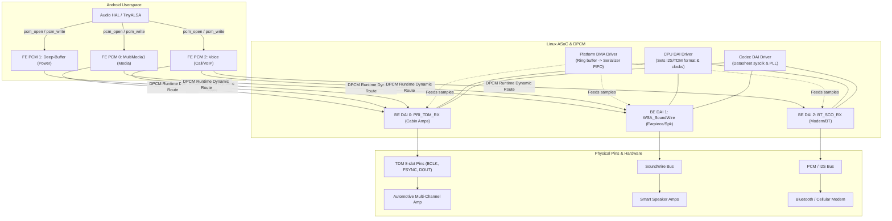

# Module 10 — ASoC, DAI, DMA, I2S, and TDM

## Short Answer

ASoC (ALSA System on Chip) is how Linux **wires** a CPU digital audio interface to a codec and a DMA engine. The PCM you opened in Module 09 is usually a **front-end**. The pins that wiggle are a **back-end DAI**. DMA is the hardware that feeds that DAI. I2S and TDM are **serial protocols** on those pins, not Android devices.

If PCM is RUNNING but `hw_ptr` does not move, you are usually in **clocks, DAI configuration, or DMA**, not in AudioPolicy.

Junior decoder (do not mix these):

| Word | Means | Not |
| --- | --- | --- |
| **SoC** | The chip (CPU + pins + often a DSP) | A driver |
| **ASoC** | Linux framework that *wires* that chip | The chip itself |
| **ALSA** | Kernel PCM you open (`hw:C,D`) | ASoC, PulseAudio |
| **DAI** | Serial **sample** cable (I2S/TDM/SLIM) | I2C |
| **DCI** | Typical datasheet name for **control** (I2C/SPI) | The music |

## Mental Model

A factory line:

| Piece | Job |
| --- | --- |
| Front-end (FE) PCM | The loading dock Android knows (`hw:0,7`) |
| DPCM routing | Which dock is connected to which machine today |
| Back-end (BE) DAI | The actual machine interface (I2S0, TDM1, SoundWire) |
| DMA / platform | The forklift moving samples to the serializer |
| Machine driver | The factory floor plan (this board’s wiring) |
| Codec driver | The machine at the other end of the cable |
| CPU DAI driver | The SoC pin controller + serializer |

### Three-level definitions

**ASoC**

- **Beginner:** The Linux audio driver framework for phones and cars.
- **Engineer:** A split into machine, platform (DMA), CPU DAI, and codec drivers, plus DAPM for power.
- **Expert:** Graph of DAPM widgets and DAI links; DPCM allows one FE to bind to different BEs at runtime (media vs voice vs low-power).

**DAI**

- **Beginner:** The digital audio port.
- **Engineer:** Digital Audio Interface: format, clocks, TDM slots, master/slave.
- **Expert:** A `snd_soc_dai` with `hw_params` and `set_fmt` / `set_tdm_slot`. Two DAIs (CPU and codec) must agree on who drives BCLK/FSYNC or you get a silent RUNNING PCM.

**DMA**

- **Beginner:** Hardware that copies audio without the CPU touching every sample.
- **Engineer:** The platform driver that fulfills period IRQs from a ring buffer.
- **Expert:** Must be coherent with the serializer’s FIFO. Wrong burst size or leftover mapping → XRUN or `hw_ptr` stuck.

**I2S vs TDM**

| | I2S | TDM |
| --- | --- | --- |
| Slots per frame | Typically 2 (L/R) | N slots (4, 8, 16…) |
| Frame sync | LRCLK, 50% or per spec | FSYNC pulse or 50%, product-specific |
| Typical use | Headset codec stereo | Automotive multi-amp, multi-mic |
| Common failure | Mode (Philips/I2S vs left-justified) mismatch | Slot mask / width / FSYNC polarity mismatch |

They are both serial audio. TDM is “I2S with more apartments in the building.”

## Architecture / Flow

### Classic ASoC card

```text
Machine driver
  defines DAI link:
    CPU DAI  <---- format/clocks ---->  Codec DAI
    Platform/DMA provides PCM ops
        ↓
ALSA card with one or more PCM devices
```

### DPCM (dynamic PCM) — common on Qualcomm and modern SoCs

```text
FE PCM  (MultiMedia1, Deep-Buffer, Voice, ...)
    ↓  DPCM runtime bind
BE DAI  (I2S, SLIMbus, SoundWire, TDM, DisplayPort)
    ↓
Codec / DSP port
```

Android’s “use case” often means **which FE + which BE + which graph**. That mapping is **vendor**, not AOSP.

### Data vs clocks (draw this)

```text
Memory buffer
    ↓  DMA
SoC FIFO / serializer
    ↓  data lines (DOUT/DIN)
Codec serializer
    ↓
DAC

Clocks (separate wires):
    MCLK  → codec / PLL
    BCLK  → bit clock
    FSYNC / LRCLK → frame
```

If clocks are absent, DMA may not increment. Some SoCs gate DMA on BCLK.

### Correcting the original course diagram

The original picture:

```text
ASoC
 +------+------+
 |             |
DMA           DAI
```

Better:

```text
ASoC machine
   FE PCM  --(DPCM)--  BE
                 |
        +--------+--------+
        |                 |
   platform DMA      CPU DAI + codec DAI
   (moves samples)   (serial format + clocks)
        |                 |
        +--------+--------+
                 |
              I2S / TDM / SLIMbus / SoundWire pins
```



DMA and DAI are **partners**, not sequential layers of the same type.

## Detailed Explanation

### 1. Four driver roles

| Driver | Typical file | Owns |
| --- | --- | --- |
| Machine | `sound/soc/<vendor>/...machine...` or board DT graph | DAI links, routing, jack, board quirks |
| Platform / DMA | SoC PCM/DMA driver | `hw_params` buffer, IRQ, pointer |
| CPU DAI | SoC I2S/TDM/SLIM driver | Serial format, master/slave, clocks |
| Codec | `sound/soc/codecs/....c` | Registers, DAPM widgets, analog |

When a clock is wrong, it is often **machine + CPU DAI + codec `set_sysclk`** disagreeing, not “the PCM layer.”

### 2. Master / slave (clock provider / consumer)

Modern kernels prefer **clock provider** language. The idea is old:

- Who generates BCLK?
- Who generates FSYNC?
- Who provides MCLK?

If both ends think they are consumer, no clocks. If both think they are provider, contention. Either way: silence or ugly noise.

Voice calls sometimes switch mastership (modem DSP becomes clock master). A path that worked for media can fail for voice **only because the clock owner changed**.

### 3. Format bits you must be able to discuss

`snd_soc_dai_set_fmt` style flags (concepts):

- I2S vs left-justified vs right-justified vs DSP_A / DSP_B (TDM-like)
- Clock inversion (BCLK/FSYNC polarity)
- Provider/consumer masks

One inverted FSYNC on an 8-slot TDM can shift every slot by one. Then “media plays on the tweeter that should be chime” while Policy is innocent.

### 4. TDM slot maps

Typical parameters:

- Slot width (16/24/32)
- Slots per frame (8)
- TX/RX masks (which slots this DAI uses)
- Sample width vs slot width (16-bit sample in 32-bit slot)

Automotive amps often expect a **fixed slot map** (FL, FR, RL, RR, center, lfe, chime, reserved). If HAL writes stereo into an 8-slot BE without placing samples in the correct slots, two speakers play and six are silent — or the wrong two play.

This is a **horizontal instance** problem: right layer (DAI), wrong slots.

### 5. Other digital transports (names only; vendor-specific)

You will meet these. They are not AOSP objects:

| Transport | Typical role |
| --- | --- |
| SLIMbus | Older Qualcomm codec interconnect |
| SoundWire | Newer low-pin audio bus |
| SPDIF / IEC958 | Optical / electrical digital out |
| HDMI / DisplayPort audio | Video-associated IEC61937 or PCM |

Do not draw them as I2S unless the board actually uses I2S there.

### 6. DAPM (preview; deeper in Module 11)

DAPM powers widgets only when a complete path exists. A DAI can be configured and still have **no DAPM path**, so the codec stays off. Symptom: PCM RUNNING, analog mute. Last-known-good can be DMA+DAI while codec widgets are off.

## Source-Code & Device Tree Path

```text
Kernel (mainline-style paths; vendor trees fork these):
  sound/soc/soc-core.c          # card/DAI link registration
  sound/soc/soc-pcm.c           # FE PCM ops
  sound/soc/soc-dapm.c          # power routing
  sound/soc/generic/            # simple-card / audio-graph-card
  sound/soc/codecs/             # codec drivers
  sound/soc/soc-dai.c
```

### Reading Audio Device Tree (DT) Bindings

On modern ARM/ARM64 Linux kernels, the machine driver is frequently synthesized directly from the Device Tree (`.dts` / `.dtsi`):

#### 1. `simple-audio-card` Example (Stereo Codec over I2S)
```dts
sound {
    compatible = "simple-audio-card";
    simple-audio-card,name = "board-stereo-audio";
    simple-audio-card,format = "i2s";
    simple-audio-card,bitclock-master = <&cpu_dai>;
    simple-audio-card,frame-master = <&cpu_dai>;

    simple-audio-card,cpu {
        sound-dai = <&i2s0>;
        dai-tdm-slot-num = <2>;
        dai-tdm-slot-width = <32>;
    };

    simple-audio-card,codec {
        sound-dai = <&codec_dac>;
        clocks = <&audio_mclk>;
    };
};
```

#### 2. `audio-graph-card` / OF Graph Example (Multi-channel TDM Amp)
```dts
sound_card {
    compatible = "audio-graph-card";
    dais = <&cpu_dai_port>;
};

&cpu_dai {
    cpu_dai_port: port {
        cpu_endpoint: endpoint {
            remote-endpoint = <&amp_endpoint>;
            dai-format = "dsp_a";               /* DSP_A / TDM mode */
            frame-master = <&cpu_dai>;          /* CPU drives FSYNC */
            bitclock-master = <&cpu_dai>;       /* CPU drives BCLK */
            dai-tdm-slot-num = <8>;             /* 8 TDM slots */
            dai-tdm-slot-width = <32>;          /* 32-bit slot width */
            dai-tdm-slot-tx-mask = <0xff>;      /* Use all 8 slots */
        };
    };
};
```

**Key DT Diagnostic Checks:**
- **`bitclock-master` / `frame-master`**: If both CPU and codec point to `<&codec>` (or both to `<&cpu>`), one is acting as provider and one as consumer. If misconfigured so neither or both generate clocks, BCLK will be absent or contended.
- **`dai-format`**: Must match the serial protocol expected by the chip (`"i2s"`, `"left_j"`, `"dsp_a"`, `"dsp_b"`).
- **`dai-tdm-slot-tx-mask`**: Defines which time slots are enabled. A mask of `0x03` on an 8-slot bus means only slots 0 and 1 transmit audio.

There is **no single AOSP file** for your board’s DAI map. It lives in the **kernel / vendor DSP** for that product. Say so in every bug report.

## Debugging

```text
PCM open OK, state PREPARED forever
   → trigger/start not issued, or start_threshold not met

PCM RUNNING, hw_ptr stuck
   → no BCLK/DMA; clock provider; BE not bound; DSP not providing clocks

PCM RUNNING, hw_ptr moving, analog silence
   → DAPM/codec/amp (next module) or TDM slot empty

Wrong speaker, right volume group
   → TDM slot map or amp channel map, not Policy

Works in media, fails in call
   → different FE/BE and clock master
```

### Evidence that belongs at this layer

- Device tree DAI format vs codec datasheet
- Scope or logic analyzer on BCLK/FSYNC/DOUT (hardware teams exist for a reason)
- Kernel ASoC logs: which FE bound to which BE
- DMA residue / pointer debug (platform-specific)

If you do not have a scope, you can still use:

- “Does `hw_ptr` move?”
- “Does a different FE (tinyplay on another device) move the same pins?”
- “Did the machine driver bind the BE we think?”

## Logs / Commands

```bash
adb shell dmesg | grep -iE 'asoc|dai|dpcm|tdm|i2s'
# sysfs graph sometimes exists:
adb shell ls /sys/kernel/debug/asoc/     # debugfs; may be disabled
```

What you expect when a path starts:

```text
FE MultimedixX bind BE I2S-Y (names are vendor)
DAPM path complete (if debug)
MCLK/BCLK enable messages (platform-specific)
```

What indicates a problem:

```text
no backend for frontend
ASoC failed to set DAI format
can't set sysclk
DMA error / FIFO underrun at the serializer
```

Exact strings are vendor/kernel specific. Search your kernel; do not quote this module as if it were a log spec.

## Common Mistakes

| Mistake | Reality |
| --- | --- |
| Equating PCM device number with I2S instance | DPCM maps them dynamically |
| “I2S is TDM with 2 slots, so formats are identical” | DSP_A/B vs I2S polarity/alignment differ |
| Fixing slot maps in CarAudio XML | XML does not place TDM slots |
| Ignoring clock provider during voice | Modem/ADSP may take over |
| Assuming SoundWire debug looks like I2S | Different bus, different tools |

## Practice

Media plays on front-left only. Policy maps MUSIC to an 8-channel bus. Flinger mix is 8ch. HAL opens 8ch PCM. `hw_ptr` moves. Tinymix shows DAC and amp enabled for all channels.

1. Which layer is last-known-good?
2. Give one kernel-level hypothesis and one HAL-level hypothesis.
3. What evidence distinguishes them?

Expected:

1. At least DMA/DAI are alive; analog enable appears good.
2. Kernel: TDM TX mask only enabling slot 0. HAL: samples only in channel 0 of the 8ch buffer (upmix bug).
3. Capture the PCM bytes (tee sink or a debug tap) vs a scope of TDM slots. If the buffer already has energy in 8 channels, HAL is good and the serializer/slots are wrong. If the buffer is stereo-in-8ch with zeros, HAL/Flinger upmix is wrong.

## Key Takeaways

1. FE PCM ≠ BE DAI ≠ I2S pins.
2. DMA moves; DAI serializes and clocks; they are partners.
3. I2S vs TDM is slotting and sync, not a different Android API.
4. Clock provider mismatch is a classic “RUNNING but dead” bug.
5. Channel-map bugs impersonate Policy bugs; prove with buffers and slots.

## Next

[Module 11 — Codec, Amplifier, and the Hardware Path](11-codec-amplifier-and-hardware-path.md)
