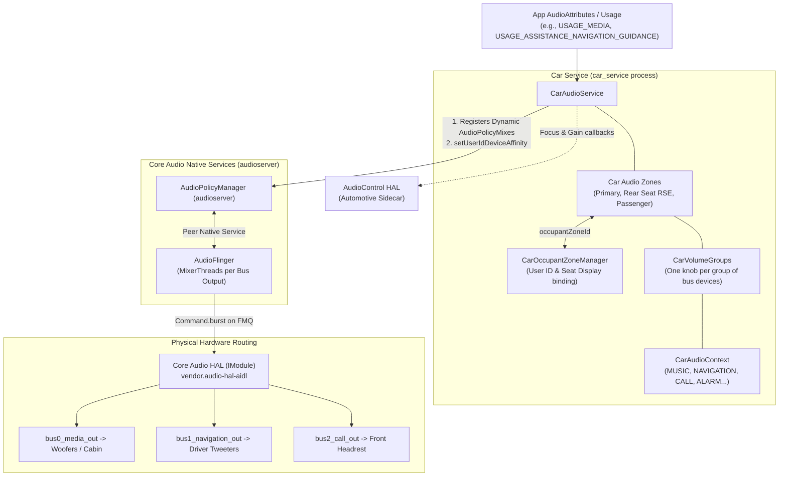

# Module 12 — AAOS Car Audio Architecture

## Short Answer

Android Automotive does **not** replace AudioFlinger or AudioPolicy. **CarAudioService** sits above them and **programs** Core Audio for a vehicle: zones, volume groups, context-to-bus routing, per-zone focus, and (later releases) dynamic zone configs, OEM plugins, and enforced fade.

Phone Android routing is “pick a device type for a strategy.” AAOS routing is “send this usage in this zone to this **bus address**, with this **volume group**, under this **focus matrix**.”

If `audioUseDynamicRouting` is false, most of this chapter is off and the product behaves much more like a phone.

**This course’s AAOS default is Android 15, car XML version 4**, on top of an AIDL Core HAL. Fade configuration exists (`car_audio_fade_configuration.xml`) and is off until `audioUseFadeManagerConfiguration` is true.

## Mental Model

A concert hall with rooms:

| Phone | Car |
| --- | --- |
| One hall | Many rooms (zones) |
| One usher (AudioService focus) | One usher per room |
| One lighting board | A lighting board per room (volume groups) |
| Speakers are “the speakers” | Each cable has a name (bus address) |

CarAudioService is the **building manager**. AudioPolicy is the **patchbay** it rewires. AudioFlinger is still the **mixing console** in the basement.

### Three-level definition: CarAudioService

**Beginner:** The car’s audio manager.

**Engineer:** A Car service that reads `car_audio_configuration.xml`, registers dynamic policy mixes, and owns zone-scoped focus and volume.

**Expert:** An orchestrator of `AudioPolicyMix` + user-id device affinity + AudioControl HAL hooks + optional OEM focus plugin + CAP engine integration (14+) + fade manager (15+). It is not a second mixer.

## Architecture / Flow

### Official teaching stack (this course)

```text
Audio Usage / AudioAttributes
             |
             v
      CarAudioService
             |
             v
      Car audio zones  ↔  occupant zones
             |
             v
     Volume groups + context-to-device map
             |
             v
     Dynamic Audio Policy mixes
             |
             v
        AudioPolicyManager
             |
             v
        AudioFlinger
             |
             v
          Audio HAL  (+ AudioControl HAL)
             |
             v
       Hardware buses / DSP / amps
```



### What happens at boot (concept)

```text
car_service starts
    ↓
CarAudioService reads vendor/etc/car_audio_configuration.xml
    (fallback search includes system/etc; vendor wins)
    ↓
Validates every device address against audio policy topology
    ↓
Builds AudioPolicyMix for each context → device in each zone config
    ↓
Registers mixes; sets user-id device affinities when users log in
    ↓
Ready to route and focus per zone
```

If an address is missing from the policy topology, service startup can fail hard (`IllegalStateException` style failures are documented when config version and content disagree).

## Detailed Explanation

### 1. Why cars cannot use phone policy as-is

A phone assumes:

- One occupant
- A handful of devices
- Media and nav can share a mixer and duck in software
- Volume is a few stream types

A car needs:

- Driver cabin ≠ rear entertainment ≠ passenger headrest
- Nav from driver-side speakers while media stays on woofers
- Chimes that never take the media knob
- Safety sounds that win even if an app is rude
- Hardware ducking (separate DACs/amps)

Dynamic routing plus buses is how AOSP expresses that without forking AudioFlinger.

### 2. The master flag

```xml
<resources>
    <bool name="audioUseDynamicRouting">true</bool>
</resources>
```

When false:

- Routing and much of CarAudioService is disabled
- Fallback toward default `AudioService` behavior

When debugging “AAOS routing not applied,” **read this flag first**.

### 3. Two HALs, not one

| HAL | Purpose |
| --- | --- |
| Core Audio HAL (HIDL or AIDL) | PCM streams, devices, writes |
| AudioControl HAL | Car-specific: HAL focus, gain callbacks, ducking/fade hints |

AudioControl cannot play samples by itself. If AudioControl is missing features, you still have PCM; you may lose elegant HAL-initiated chimes or OEM fade hooks.

### 4. Occupant zone vs audio zone

| | Occupant zone | Audio zone |
| --- | --- | --- |
| Owner | `CarOccupantZoneManager` | CarAudioService |
| Means | Seat + displays + user | Independent audio universe |
| Mapping | `occupantZoneId` in car audio XML | `audioZoneId` |
| Rule | One-to-one with an audio zone when used | Primary zone id is `PRIMARY_AUDIO_ZONE` |

A user logs into a display → occupant zone gets a user id → CarAudioService applies **device affinity** so that user’s tracks hit that zone’s buses.

### 5. Versioned capabilities (high level)

Details in Module 13 and 23. Mental timeline:

| Android | Car audio highlights |
| --- | --- |
| 10 | `car_audio_configuration.xml` replaces older volume XML / `getBusForContext` |
| 11 | `audioZoneId`, `occupantZoneId`; HAL focus; delayable focus; nav-during-call setting |
| 14 | Config v3: OEM contexts, non-primary dynamic zone configs, OEM plugin, CAP hooks |
| **15 (this course)** | **Config v4** + `car_audio_fade_configuration.xml`; system-enforced fade |

Older XML can run on newer AAOS until you use new fields. Using new fields in an old version throws at startup. Design new products on **v4**.

### 6. CAP engine (Android 14+)

Configurable Audio Policy engine can take over **volume and/or routing** (`useCoreAudioVolume`, `useCoreAudioRouting`). Then OEM-defined contexts must align with CAP product strategies. This is optional. Many products still use dynamic mixes + default APM.

If a bug is “strategy name mismatch,” ask whether CAP is enabled before reading `enginedefault`.

## Source-Code Path

```text
packages/services/Car/service/src/com/android/car/audio/CarAudioService.java
packages/services/Car/service/src/com/android/car/audio/CarAudioFocus.java
packages/services/Car/service/src/com/android/car/audio/CarAudioZone.java
packages/services/Car/service/src/com/android/car/audio/CarVolumeGroup.java
packages/services/Car/service/src/com/android/car/audio/CarAudioContext.java
packages/services/Car/service/src/com/android/car/audio/CarAudioSettings.java

API:
packages/services/Car/car-lib/src/android/car/media/CarAudioManager.java

Config examples:
device/generic/car/emulator/audio/car_audio_configuration.xml
device/generic/car/emulator/audio/car_audio_fade_configuration.xml   # 15+

Framework hook:
AudioService.registerAudioPolicy / setUserIdDeviceAffinity
```

Start every AAOS source session at `CarAudioService` setup/init and the XML parser for your config version.

## Debugging

```text
AAOS feature “not working”
   |
   +-- Is this actually AAOS (FEATURE_AUTOMOTIVE)?
   |       No  → you are on phone policy
   |       Yes ↓
   +-- audioUseDynamicRouting true?
   |       No  → flag / overlay
   |       Yes ↓
   +-- Did CarAudioService start without exception?
   |       No  → XML version/address validation
   |       Yes ↓
   +-- dumpsys shows zones, groups, mixes?
           No  → init path
           Yes → Module 13 (mapping) or 14 (focus)
```

### Phone vs car: the sentence you should be able to say

> Phone Policy picks a *device type* for a *strategy*.  
> CarAudioService forces a *bus address* for a *context in a zone* by installing *dynamic mixes* and *user affinities*.  
> AudioFlinger still mixes each opened bus independently.

## Logs / Commands

```bash
adb shell dumpsys car_service --services CarAudioService
adb shell dumpsys media.audio_policy    # look for dynamic mixes and BUS devices
adb shell dumpsys media.audio_flinger
adb logcat -s CarAudioService CarAudioFocus CarAudioZones
```

What you expect after boot on a healthy image:

```text
Config version parsed
N zones, each with volume groups
All contexts assigned in the active zone config
Dynamic mixes registered
No crash loop of car_service
```

What indicates a problem:

```text
IllegalStateException about config version
Missing device address
audioUseDynamicRouting false in the running overlay
Zero zones
```

## Common Mistakes

| Mistake | Reality |
| --- | --- |
| “AAOS has its own AudioFlinger” | It does not |
| Debugging phone speaker device on a bus product | Cabin is BUS |
| Forgetting occupant ↔ audio zone mapping | User lands in the wrong room |
| Treating AudioControl as sufficient | No PCM without Core HAL |
| Editing DSP graphs to fix a context map | Prove mixes first |

## Practice

A music app on the rear display plays from the **driver** speakers. Rear headphones are silent.

1. Which AAOS objects might be wrong?
2. Which two dumps confirm where PCM went?
3. Give one software-config hypothesis and one login/affinity hypothesis.

Expected:

1. Occupant zone mapping, audio zone of that user, zone config (headrest vs cabin), user-id device affinity.
2. `dumpsys car_service` (zone for that user) + `dumpsys media.audio_flinger` (bus address of the ACTIVE track).
3. Config: rear usages still mapped to primary buses. Affinity: user not associated with rear occupant zone, so mixes used primary zone devices.

## Key Takeaways

1. CarAudioService programs Policy; it does not mix.
2. Dynamic routing flag is the master switch.
3. Zone, occupant zone, bus, and volume group are four different objects.
4. Core HAL plays PCM; AudioControl is the car sidecar.
5. Config version determines which features even parse.

## Next

[Module 13 — Zones, Volume Groups, and Car Routing](13-aaos-zones-volume-groups-and-routing.md)
