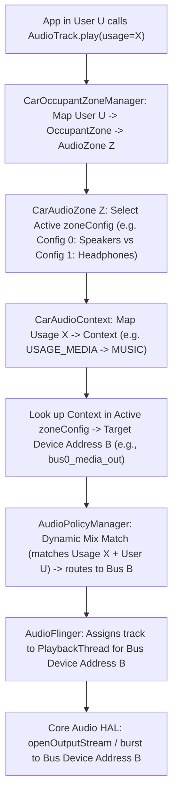

# Module 13 — Zones, Volume Groups, and Car Routing

## Short Answer

An **audio zone** is an independent universe of routing, focus, and volume. A **volume group** is a set of output devices that share one knob. A **context** maps usages onto a device **address** inside a zone config. Dynamic routing installs those maps as AudioPolicy mixes. If any of those four objects is wrong, you will debug the HAL forever and never find it.

## Mental Model

A hotel:

| Object | Hotel analog |
| --- | --- |
| Occupant zone | Room number + keycard + TV |
| Audio zone | The room’s sound system |
| Zone config | “Speakers” vs “headphones” mode for that room |
| Volume group | One knob that moves several amps together |
| Context | Type of sound (movie, doorbell, minibar alarm) |
| Device address | A labeled cable on the back of the amplifier |

The primary zone is the lobby. It is special: there is only one, id is `PRIMARY_AUDIO_ZONE`, and from Android 14 it may have **only one** configuration.

### Three-level definitions

**Audio zone**

- **Beginner:** A set of speakers that play together as one space.
- **Engineer:** Independent focus, routing, and volume domain with a unique `audioZoneId`.
- **Expert:** A list of zone configs; each config is volume groups of bus devices with complete context coverage. Non-primary zones may switch configs at runtime (14+).

**Volume group**

- **Beginner:** One volume bar.
- **Engineer:** All devices in the group receive the same gain changes; their HAL gain curves should match.
- **Expert:** With `useFixedVolume`, Android does not attenuate PCM; it sends a group index to the HAL. With CAP volume, the group **name** must match the engine.

**Context**

- **Beginner:** Music vs nav vs call, etc.
- **Engineer:** `CarAudioContext` grouping of usages.
- **Expert:** Static table, or OEM-defined contexts (config v3+) that must cover all usages and not overlap.

## Architecture / Flow

### Config v2 shape (still everywhere)

```xml
<audioZoneConfiguration version="2.0">
  <zone name="primary zone" isPrimary="true" occupantZoneId="0">
    <volumeGroups>
      <group>
        <device address="bus0_media_out">
          <context context="music"/>
          <context context="announcement"/>
        </device>
        ...
      </group>
      ...
    </volumeGroups>
  </zone>
  <zone name="rear seat zone" audioZoneId="1" occupantZoneId="1">
    ...
  </zone>
</audioZoneConfiguration>
```

### Config v3 additions (Android 14)

```text
oemContexts (optional)
zones
  zone
    zoneConfigs
      zoneConfig (primary: exactly one)
        volumeGroups ...
```

Non-primary zones may have multiple `zoneConfig` entries (headrest vs headphones).

### Config v4 (Android 15 — this course’s default)

```text
applyFadeConfigs / fadeConfig  inside a zoneConfig
  → names defined in car_audio_fade_configuration.xml
```

Use v4 for every new example in this course. v2/v3 snippets above are what you inherit on upgrades, not what you write.

### Runtime routing

```text
App in user U plays usage X
    ↓
User U → occupant zone → audio zone Z
    ↓
Active zoneConfig of Z
    ↓
context(X) → device address B
    ↓
dynamic mix: match X (and user) → force B
    ↓
AudioFlinger PlaybackThread for BUS:B
```



## Detailed Explanation

### 1. Completeness rules (these cause boot failures)

From AOSP car audio configuration docs:

- All audio contexts (static or OEM) must be assigned **in each** audio configuration.
- Device addresses must exist in audio policy configuration.
- Addresses should be unique across zones/configs (a device name appears only once).
- Devices in one volume group should share the same gain configuration.
- `audioZoneId` / `occupantZoneId` are unique and one-to-one.
- Primary zone `audioZoneId` is always primary; `isPrimary="true"` implies that.

If a context is missing, routing for that usage is undefined. Do not “leave emergency off the map.”

### 2. Why separate buses exist

Separate buses allow:

- Independent HAL post-processing
- Hardware mix / duck / EQ per context
- Independent mute
- Independent amps or TDM slots
- Independent volume groups

If you put `music` and `navigation` on the same device for “simplicity,” you **gave up hardware ducking**. Flinger will mix them digitally at whatever volumes Policy applied (often 1.0 each on fixed-volume products).

Product rule of thumb from AOSP: keep **system/emergency/safety** off the media bus so they can have higher priority in HAL and focus.

### 3. Volume groups vs what the user thinks

The user has “the volume knob.” You may have five groups. The knob’s binding is a **UI policy** (usually media group in the active zone). Nav can be loud while media is at 0. That is correct if they are different groups.

`useFixedVolume`:

- Android still tracks indices per group
- PCM is not scaled in Flinger
- HAL must apply gain
- If HAL no-ops gain, knobs lie

CAP: group `name` attributes must match engine volume names; `useFixedVolume` must be false when using CAP volume (per official notes).

### 4. Dynamic zone configuration (14+)

Use case: rear passenger switches from headrest speakers to Bluetooth/USB headphones.

```text
Zone 1 config 0: bus_100 headrest   (default)
Zone 1 config 1: bus_101 headphones
```

CarAudioManager APIs query and switch configs. Switch path uses `AudioPolicy#setUserIdDeviceAffinity` with the new device list. Only one config is active; audio does not leak to both.

Primary zone cannot do this multi-config trick as of the documented Android 14 rule.

### 5. Primary-zone cast and mirror (14+)

Documented multi-zone features:

| Feature | What happens |
| --- | --- |
| Passenger cast to primary | Passenger media device affinity replaced with **driver media bus**; other passenger buses remain |
| Audio mirror | Passenger media redirected to a **mirror bus**; HAL is told to duplicate to participating zones via `setParameters` |

Cast requirement: primary media output must be **isolated** from other usages, or the mix will drag extra attributes into the cabin.

Mirror devices are declared in a `mirroringDevices` section of the car audio config. HAL duplication is **vendor**. The framework only sends the parameter string.

### 6. OEM contexts (14+)

You may split `GAME` from `MEDIA` if the product wants different buses. Rules:

- Optional
- Unique names
- Each usage in exactly one context
- All `AudioAttributes` usages covered
- Use the `AUDIO_USAGE_*` string forms from the policy enum namespace

If you also use CAP, names/strategies must match the engine.

## Source-Code Path

```text
Car audio XML parser (name varies by version):
  packages/services/Car/service/src/com/android/car/audio/CarAudioSettings.java
  .../CarAudioZonesHelper*.java
  .../CarAudioContext.java

Volume:
  .../CarVolumeGroup.java
  .../CarVolume.java

Routing / affinity:
  CarAudioService methods that call
    AudioManager.setAudioPortGain / setUserIdDeviceAffinity
    AudioPolicy.registerAudioPolicy / addMix

Public:
  android.car.media.CarAudioManager
    getAudioZoneIds
    getVolumeGroupIdForUsage
    setVolumeGroupVolume
    (config query/switch APIs on 14+)
```

Read the parser for **your version** before you invent tags. Unknown tags in an old parser will not do what you hope; they may crash.

## Debugging

```text
Sound in the wrong place or wrong knob
   |
   +-- What usage did the app set?           (Module 05)
   +-- What user / occupant / zone?
   +-- What is the active zoneConfig?
   +-- What address does that context map to?
   +-- Does audio_policy_configuration.xml define that address?
   +-- Does Flinger’s ACTIVE track show that address?
   +-- Does HAL open the PCM behind that address?
```

If Flinger’s address matches XML and the physical speaker is still wrong, **leave this module** (TDM slots / amp). If it does not match, stay here.

### XML diff technique

Print the running interpretation, not just the file:

```bash
adb shell dumpsys car_service --services CarAudioService
```

Humans edit the wrong overlay. The dump is what booted.

## Logs / Commands

```bash
adb shell dumpsys car_service --services CarAudioService
adb shell dumpsys media.audio_policy | grep -i -A2 -E 'mix|bus|address'
```

What you expect:

```text
Each zone lists groups and context→address
Active config named
Focus holders tagged with zone
Flinger BUS address equals the map
```

What indicates a problem:

```text
Context missing
Two zones claim one address
Volume group index changes, HAL gain does not (fixed volume + HAL no-op)
Zone config switch did not change Flinger device
```

## Common Mistakes

| Mistake | Reality |
| --- | --- |
| One bus for everything “to keep XML small” | You deleted hardware concurrency |
| Volume group = context | A group can contain several devices/contexts |
| Forgetting a context in a secondary config | Illegal / incomplete config |
| Typo `bus0_media` vs `bus0_media_out` | Silent or fallback routing |
| Expecting primary zone multi-config on 14 | Not allowed |
| Using media knob to debug nav level | Wrong group |

## Practice

Given v2 XML:

- Group A: `bus0_media_out` ← music, announcement
- Group B: `bus1_navigation_out` ← navigation
- Group C: `bus7_system_sound_out` ← system_sound, emergency, safety, vehicle_status

The OEM adds `USAGE_ASSISTANT` but never lists `voice_command`.

1. What happens to assistant audio?
2. Is this a HAL bug?
3. How do you prove it in 60 seconds?

Expected:

1. Incomplete context coverage. Startup may fail, or behavior is undefined/fallback depending on version and how strictly the parser validates. Either way, you must not assume a bus.
2. No.
3. `dumpsys car_service` — look for missing context or a crash in car audio init; confirm app usage; confirm Flinger address if a track exists.

**Second question:** Why must devices in a volume group share gain curves?

Because one index is applied to all of them. Different HAL ranges would make one device scream while another whispers at the same user step.

## Key Takeaways

1. Zone / config / group / context / address are five distinct objects.
2. Every context must be mapped in every active config.
3. Separate buses buy hardware ducking and independent knobs.
4. Fixed volume moves gain to the HAL; prove it there.
5. Always join car dump address to Flinger address.

## Next

[Module 14 — Concurrency, Mixing, and Ducking](14-concurrency-mixing-and-ducking.md)
