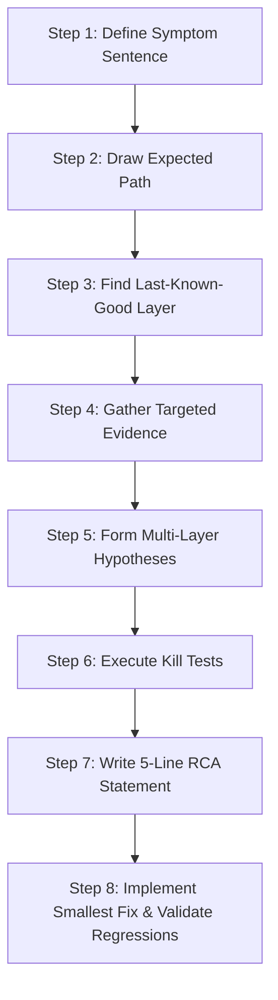
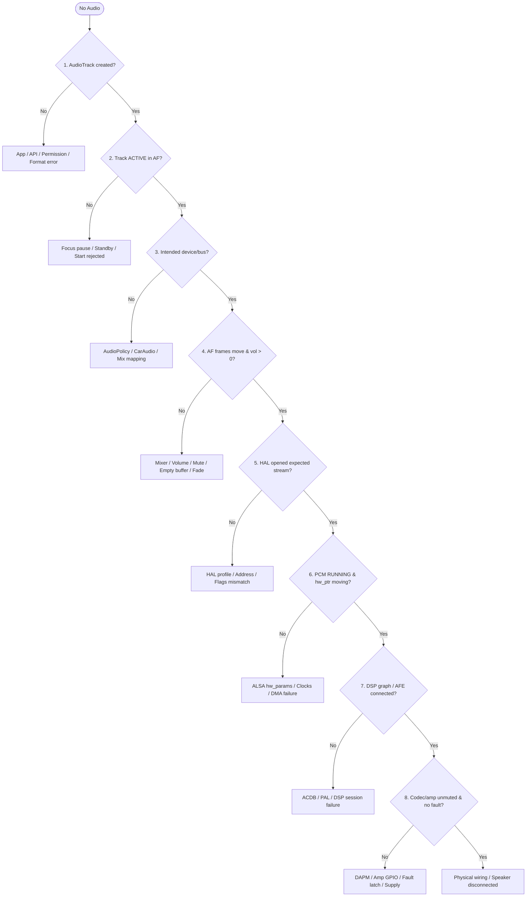

# Module 19 — Debugging Methodology

## Short Answer

Do not start with a patch. Start with a **symptom sentence**, an **expected path**, a **last-known-good layer**, and **competing hypotheses** that you can kill with evidence. A fix without that chain is a guess that will regress.

This module is the habit that turns the rest of the course into field skill.

## Mental Model

A medical diagnosis:

```text
Complaint (symptom)
  → expected physiology (path)
  → last healthy organ (last-known-good)
  → labs (dumps)
  → differential diagnosis (hypotheses)
  → rule out
  → disease (root cause)
  → treatment (fix) + follow-up (validation)
```

You would not amputate for a fever. Do not rewrite the HAL for a wrong usage.

## The eight steps (always)

### Step 1 — Define the symptom

Write one sentence the user would recognize. No jargon.

> AudioTrack starts successfully but no sound is heard from the driver tweeters during navigation, while media is audible.

Include:

- What works
- What does not
- When (first time, after BT, after sleep)
- Where (which seat / accessory)

### Step 2 — Identify the expected path

Draw it. For the sentence above:

```text
Nav app
  USAGE_ASSISTANCE_NAVIGATION_GUIDANCE
  CarAudio zone 0 context NAVIGATION
  bus1_navigation_out
  AudioFlinger thread for that bus
  HAL use case for nav
  PCM / ADSP graph
  TDM slots for tweeters
  amp
  tweeters
```

If you cannot draw expected, you cannot see deviation.

### Step 3 — Last-known-good layer

Collect the **smallest** evidence that proves a layer still works. Stop at the first layer that fails the proof.

### Step 4 — Gather evidence (targeted)

Only what distinguishes hypotheses. See the menu below.

### Step 5 — Hypotheses (multiple layers)

Write at least three, on **different** layers.

```text
A: Wrong usage → music bus (app)
B: Nav context mapped to media bus (XML)
C: Flinger track never ACTIVE (start/focus)
D: HAL opened media PCM instead of nav PCM
E: Nav graph/TDM slots not unmuted
```

### Step 6 — Eliminate

Each hypothesis needs a **kill test**.

| Hypothesis | Kill test |
| --- | --- |
| A | Log attributes; if usage is nav, A is dead |
| B | car dump context→address; if bus1, B is dead |
| C | Flinger ACTIVE on any bus |
| D | HAL open log card/device vs nav map |
| E | mixer/graph/amp for that path |

Never leave two living hypotheses that predict the same dump.

### Step 7 — Root cause statement

Use the five-line format from Module 21:

```text
Symptom:
Immediate failure:
Root cause:
Contributing factor:
Fix:
```

### Step 8 — Fix + validation + regressions

Name the layer you will change, why it is the smallest, what you will measure, and what else could break.



## Decision tree (no audio)

```text
No audio
   |
   +-- Is AudioTrack / player created?
   |       No → Framework/API / permission / format rejected
   |
   +-- Is track ACTIVE in AudioFlinger?
   |       No → start, focus pause, standby, wrong session
   |
   +-- Is the output the intended device / bus / zone?
   |       No → AudioPolicy / CarAudio / connection state
   |
   +-- Are Flinger counters moving and volume non-zero?
   |       No → mixer, mute, empty writes, fade
   |
   +-- Did HAL open the expected stream?
   |       No → HAL flags/use case/address
   |
   +-- Is PCM RUNNING and hw_ptr moving?
   |       No → ALSA params, trigger, clocks, DMA
   |
   +-- DSP graph / AFE (if vendor DSP)?
   |       No → vendor session / ACDB / IPC
   |
   +-- Codec/amp unmuted, no fault?
           No → DAPM, mixer, GPIO, fault, vehicle amp ECU
```



Specialize this tree; do not skip rungs because you “just know.”

---

## Systematic Debugging Playbooks

### Playbook 1 — No Audio / Silence

**First 3 commands:**
```bash
adb shell dumpsys media.audio_flinger
adb shell dumpsys media.audio_policy
adb shell dumpsys car_service --services CarAudioService  # if AAOS
```

**Interpretation & Next Branch:**
1. **No track in Flinger:** Check `logcat -s AudioTrack` for client create failures, permission denials (`RECORD_AUDIO` / `MODIFY_AUDIO_ROUTING`), or uncaught app exceptions.
2. **Track in Flinger, but state is PAUSED / STOPPED:** Check `dumpsys audio` / `dumpsys car_service` for focus loss. Confirm whether app received `AUDIOFOCUS_LOSS` or if framework fade/mute is active.
3. **Track is ACTIVE, but `vol=0.000`:** Track is muted in software. Check volume group index, stream volume, or AAOS FadeManager state.
4. **Track is ACTIVE, `vol=1.000`, frames moving:** Framework is good. Check HAL StreamDescriptor state (`STANDBY` vs `ACTIVE` vs `ERROR`) and test TinyALSA bypass (`tinyplay /data/local/tmp/test.wav -D 0 -d <pcm_device>`).

---

### Playbook 2 — Audio on Wrong Device / Wrong Speaker

**First 3 commands:**
```bash
adb shell dumpsys media.audio_flinger | grep -E 'MixerThread|device|BUS|Track'
adb shell dumpsys media.audio_policy | grep -A5 -E 'mix|bus|address'
adb shell dumpsys car_service --services CarAudioService  # if AAOS
```

**Interpretation & Next Branch:**
1. **Flinger shows wrong bus address (e.g. `bus0_media_out` instead of `bus1_navigation_out`):**
   - Check app's `AudioAttributes` usage via logcat. Did app use `USAGE_MEDIA` instead of `USAGE_ASSISTANCE_NAVIGATION_GUIDANCE`?
   - Check `dumpsys car_service` active `zoneConfig`. Is context mapped to the right bus?
2. **Flinger shows correct bus address, but sound comes from wrong physical speaker (e.g. tweeter instead of door speaker):**
   - Framework routing is innocent. Check kernel DAI / TDM slot mapping (`Module 10`) or amplifier multi-channel routing (`Module 11`).
   - Check vendor DSP AFE port mapping (`Module 16`).
3. **Sound stays in cabin when Bluetooth / USB connected:**
   - Check `dumpsys media.audio_policy` available devices. Is `AUDIO_DEVICE_OUT_BLUETOOTH_A2DP` present? If not, BT stack never notified Policy.
   - If present, check AAOS dynamic mix rules: AAOS mixes targeting `BUS` devices take precedence over phone-style fallback routing.

---

### Playbook 3 — Audio Glitches / Drops / XRUNs

**First 3 commands:**
```bash
adb shell dumpsys media.audio_flinger    # record underrun counters
sleep 2
adb shell dumpsys media.audio_flinger    # compare underrun counters
adb shell dmesg | grep -iE 'underrun|xrun|EPIPE|-32'
```

**Interpretation & Next Branch:**
1. **`AudioTrack` / client underrun counter climbing:** Producer is too slow. App thread blocked, decoder stalled, GC pause, or Binder latency on client side.
2. **Flinger track underrun climbing, client underrun = 0:** AudioFlinger `MixerThread` missed its period deadline. CPU overload, scheduler starvation, heavy effects processing, or blocking logging in `threadLoop`.
3. **Flinger counters stable, but kernel / ALSA logs show `EPIPE` / underrun:**
   - HAL thread missed period deadline to ALSA ring buffer.
   - Buffer too small for current system load. Compute `period_ms = period_frames * 1000 / sample_rate`.
   - Check CPU frequency governors / thermal throttling.
4. **All counters = 0, but user hears clicks/pops:** Not an XRUN. Check power standby/resume sequencing (Module 18), volume ramps, or Bluetooth RF packet loss.

---

### Playbook 4 — High Latency / Delayed First Sound (Cold Start)

**First 3 commands:**
```bash
adb logcat -v threadtime -s AudioTrack AudioFlinger APM_AudioPolicyManager audio_hw_primary
# Reproduce playback after 30 seconds of idle
```

**Interpretation & Next Branch:**
1. **Delta between `AudioTrack.play()` and `AudioFlinger Track::start()` > 20ms:** Binder IPC delay or main thread contention in app/audioserver.
2. **Delta between `Track::start()` and the HAL leaving standby (`Command.start` / first `burst` reply) > 50ms:** Standby exit latency on the already open stream. The vendor HAL may be re-opening its PCM, creating the DSP graph or looking up ACDB calibration. (`openOutputStream` is not on this path; it ran when the output was opened.)
3. **HAL burst occurs immediately, but acoustic output delayed by 100ms+:**
   - Codec / Smart Amp power-up ramp delay.
   - Amplifier unmute GPIO sequence deliberately delaying to prevent pops.
   - Measure with oscilloscope on amp EN pin vs speaker terminal.

---

### Playbook 5 — Volume Control Not Responding / Stuck

**First 3 commands:**
```bash
adb shell dumpsys car_service --services CarAudioService  # if AAOS
adb shell dumpsys audio                                   # if phone
adb shell dumpsys media.audio_flinger | grep -A3 -i 'vol'
```

**Interpretation & Next Branch:**
1. **Volume group index changes in `dumpsys car_service`, but Flinger volume stays `1.000`:**
   - Normal on AAOS with `useFixedVolume=true`. AudioFlinger does not attenuate PCM; HAL / external DSP / smart amp owns gain.
   - CarAudioService applies the group's gain in millibels with `AudioManager.setAudioPortGain()`, which reaches the HAL as `IModule.setAudioPortConfig` with an `AudioGainConfig` on the bus device port. Check the HAL log for that call (and the vendor amp/DSP IPC behind it). `setMasterVolume` is not the per-group mechanism. If the HAL ignores the port config, volume will not move.
2. **Volume slider in UI does not change the active volume group:** UI focused on media volume while sound is navigation or system sound.
3. **Hardware audio screams at min non-zero volume:** Mismatch between framework volume curve (logarithmic) and amplifier gain step table (linear or double-attenuated).

---

### Playbook 6 — Audio Failure After Bluetooth Disconnect

**First 3 commands:**
```bash
adb shell dumpsys media.audio_policy | grep -i -A5 'available devices'
adb shell dumpsys media.audio_flinger | grep -i -A3 'MixerThread'
adb shell dumpsys bluetooth_manager
```

**Interpretation & Next Branch:**
1. **`AUDIO_DEVICE_OUT_BLUETOOTH_A2DP` still listed in Policy available devices:** Bluetooth stack crashed or failed to call `AudioService.setDeviceConnectionState(UNAVAILABLE)`. AudioFlinger is writing to a dead HAL stream.
2. **Policy updated to `SPEAKER`, but Flinger thread is in `standby: yes` or has `ERROR` state:** The speaker output is already open, so this is standby exit failing on that stream (`Command.start`/`burst` error), or the vendor HAL failing to re-acquire the speaker PCM/graph after the BT path released it. Check HAL logs for resource contention or DSP graph teardown failure.
3. **Policy and Flinger both show `SPEAKER`, frames moving, but no sound:** Power management / DAI clock failure during device switch. Codec DAPM route or amplifier enable GPIO dropped during reroute and never re-asserted.

## Evidence menu (use the fewest)

| Question | Tool |
| --- | --- |
| What did the app ask for? | app log of attributes, session, write result |
| Who holds focus? | `dumpsys audio` / `dumpsys car_service` |
| Where did Policy send it? | `dumpsys media.audio_policy` |
| Is Flinger mixing it? | `dumpsys media.audio_flinger` (twice) |
| AAOS map? | `dumpsys car_service --services CarAudioService` |
| Time-correlated events? | `logcat -v threadtime` |
| Kernel? | `dmesg` |
| PCM? | `/proc/asound`, tinyplay bypass |
| Mixer? | `tinymix` diff |
| What PCM actually contained? | tee sink (userdebug only; verify on your branch) |
| Scheduling? | Perfetto with audio tags |
| Vendor DSP? | *board-supported* vendor logs only |

Do not ask a junior for “all logs.” Ask for **these four** and say why.

### Minimum set template

When you are stuck, demand:

```text
1. Android version + HAL generation + AAOS or not
2. Exact reproduction (including idle/BT)
3. dumpsys media.audio_flinger during the fail (twice — watch frames + StreamDescriptor.State)
4. dumpsys media.audio_policy during the fail
+ if AAOS: dumpsys car_service --services CarAudioService
+ if lower-layer suspected: IModule open/burst logs and whether tinyplay works
```

Prefer `labs/capture_audio_lab.sh` so classification is in the same folder.

Why each:

1. Names which APIs exist.
2. Selects cold vs route vs focus trees.
3. Proves execution.
4. Proves decision.
5. Proves zone/context/group.
6. Splits HAL from analog.

## Who / Where / When / What / Why / How

Fill this table on every bug:

| | Example |
| --- | --- |
| WHO | CarAudio mapping vs HAL nav use case |
| WHERE | context NAVIGATION → address |
| WHEN | every nav prompt, not only after sleep |
| WHAT | car dump vs Flinger address mismatch |
| WHY | typo in overlay XML actually booted |
| HOW | boot the overlay, dump, play nav CTS-like tone |

## Common process failures (not audio failures)

| Process failure | Result |
| --- | --- |
| Jumping to a HAL patch from a verbal symptom | 3 extra bugs |
| Collecting 2 GB of logcat | Nobody reads it |
| Testing a different build than the dump | Ghosts |
| Changing three things at once | You cannot name the fix |
| No known-good comparison | You will “fix” normal behavior |
| Debugging without saying the zone | Horizontal miss |

## Practice

Symptom: “After a call, media does not resume. The app shows playing.”

Write Steps 1–5 only (no fix). Then compare:

**Expected sketch:**

1. Symptom as above + whether in-call audio worked + speaker vs BT.
2. Expected: call ends → focus returns to media → same bus ACTIVE → HAL media path up.
3. Last-known-good unknown until dumps.
4. Evidence: focus stack, Flinger track state/volume, device, HAL standby.
5. Hypotheses:  
   A. App ignored `AUDIOFOCUS_GAIN` after loss (app).  
   B. Focus never returned (CarAudioFocus / call HAL focus stuck).  
   C. Track ACTIVE but volume 0 / fade not restored (15+ fade).  
   D. Device still SCO (Policy connection).  
   E. Media graph not rebuilt after voice (vendor).

If you wrote only “HAL is broken,” redo the exercise.

## Key Takeaways

1. Symptom → path → last-known-good → hypotheses → kill tests → RCA → fix.
2. Competing hypotheses must live on different layers.
3. Ask for the minimum dumps that distinguish them.
4. Decision trees prevent skipped rungs.
5. Process mistakes create “unsolvable” audio bugs.

## Next

[Module 20 — Logs, Dumps, and Traces](20-logs-dumps-and-traces.md)
